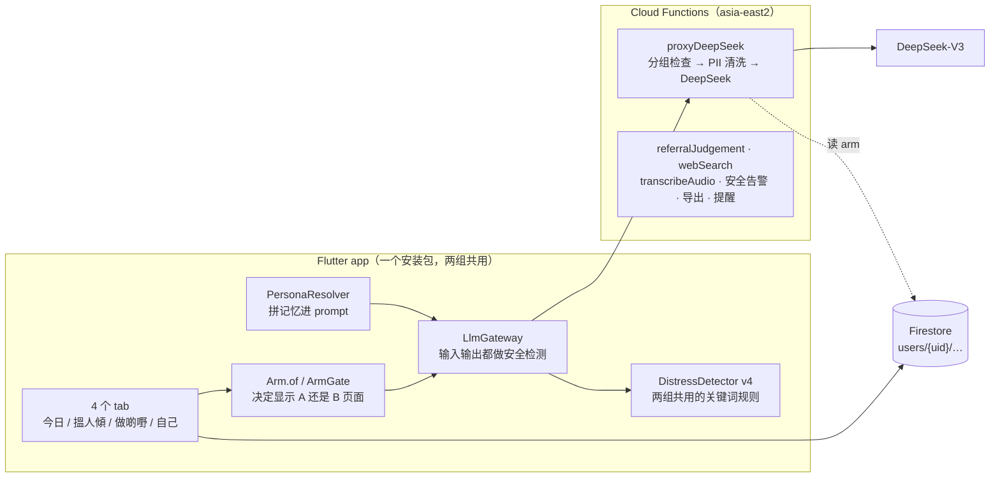

# 陪住 系统架构现状与 Phase B 切换说明

> 2026-09-29 · 基于 `main`（c80a2ab）读代码核对，每条说法附文件位置。
> 读者：项目负责人。目的：看懂现在的系统，以及 Phase B（两组随机分配）上线前要改什么。

**一句话：** 现在所有人都在 Hybrid 组（Arm A）。Rule-based 组（Arm B）只有签到和回忆两个模块做了独立页面，通通和阿珍/阿伯自由对话没有 B 版本。本次改动把「Phase A 全员 A / Phase B 按分组」做成一个编译开关，并补上服务端防线和几处安全问题。剩下的 P0 待办见第 5 节。

---

## 1. 系统组成



| 部分 | 位置 | 说明 |
|---|---|---|
| 分组判断 | `lib/core/arm/arm_scope.dart` | `Arm.of` 返回当前用户的组；`ArmGate` 按组渲染 A 或 B 页面 |
| 编译开关 | `lib/core/feature_flags/feature_flags.dart` | `PHASE_B`：`flutter build … --dart-define=PHASE_B=true` |
| 分组分配 | `lib/features/auth/data/arm_assigner.dart` | 注册时按 UCLA × 年龄 分 4 层，层内平衡 A/B，计数器在 `meta/arm_counter` |
| LLM 入口 | `lib/core/llm/llm_gateway.dart` | 所有 A 组 LLM 调用唯一入口；急性风险输入直接拦截，不调模型 |
| 服务端 | `functions/index.js` | `proxyDeepSeek` 拼 prompt 文件 + 记忆后缀，清洗电话/邮箱/身份证，调 `deepseek-chat` |
| Agent 设定 | `functions/prompts/*.txt` | 小欣 / 阿珍阿伯 / 通通 三份 prompt |
| 安全规则 | `firestore.rules` | 用户只能读写自己 `users/{uid}` 下的数据；分组字段只能写一次（本次新增） |

## 2. 一条消息的旅程（A 组，以小欣为例）

1. 老人在签到页输入一句话（`check_in_arm_a.dart`）。
2. `PersonaResolver` 读小欣的记忆（滚动摘要），拼成 `contextSuffix`（`persona_resolver.dart:105-146`）。
3. `LlmGateway` 先用关键词检测输入：
   - acute（急性）→ 不调模型，显示热线，打开紧急支援页；
   - moderate → 照常回复，回复后弹出可关闭的支援底板；
   - 两者都写 `safety_events`，由 `onSafetyEventCreated` 通知 PI。
4. 调 `proxyDeepSeek`：服务端检查分组 → 拼 prompt → 清洗个人信息 → DeepSeek → 计算 5 个机制标记。
5. 回复再做一次安全检测后显示；未触发安全标记的这一轮写入记忆缓冲区。
6. 离开页面时：把本次对话折叠进滚动摘要（一次额外 LLM 调用），满足条件时弹 Brief PR。

**B 组：** 同样的签到页外壳，但没有第 2、4 步；回应来自固定题目和模板。安全检测（第 3 步的关键词部分）两组完全相同。

## 3. 各模块在两组的现状

| 模块 | A 组（Hybrid） | B 组（Rule-based） | Phase B 前状态 |
|---|---|---|---|
| M2 小欣 签到 | LLM 对话 + 记忆 | 心情脸 + 3 道选择题 + 一段文字（`check_in_arm_b.dart`） | ✅ 有 B 页，经 `ArmGate` 进入 |
| M3 阿珍/阿伯 回忆 | LLM 对话 + 周摘要 | 固定主题开场 + 一个输入框（`reminiscence_arm_b_page.dart`） | ✅ 有 B 页 |
| 阿珍/阿伯 自由对话 | LLM（`reflective_dialogue_page.dart`） | **无** | ❌ 入口 `my_story_page.dart:91` 不分组 |
| 通通 | LLM 闲聊 + 文章问答 | 规则池 20 条开场白已写好（`tung_tung_rule_pool.dart`），**未接入** | ❌ 入口 `agent_tile_row.dart:116`、`continue_chat_card.dart:132`、`agent_profile_controller.dart:83` 不分组 |
| M5 反思 | 按上下文生成题目 | 固定题库轮换 | ✅ 页内分支 |
| M6 社交建议 | 个性化建议 | 16 条建议池 | ✅ 页内分支 |
| M7 行动计划 | LLM 辅助 | 模板（`action_loop_arm_b_page.dart`） | ✅ 页内分支 |
| M8 文章 | 多一个「問通通呢篇」 | 无该按钮 | ✅ |
| M9 进度 | 多一张 LLM 周小结卡 | 无该卡 | ✅ |
| 首页问候、跨 agent 转介 | LLM 生成 | 不出现 | ✅（问候预热本次加了分组判断） |
| 安全检测、问卷、推送 | 相同 | 相同 | ✅ 两组共用 |

## 4. 记忆现状（与《记忆模块技术交付文档 v0》对照）

A 组现在已经有一版跨会话记忆。`cross_session_memory` 是 5 个「LLM 独有机制」标记之一（`functions/llm_flags.js`），也就是说它属于 Phase A/B 的 A 组干预内容。B 组没有跨会话记忆。

| v0 文档里的层 | 代码现状 |
|---|---|
| 会话摘要 | 每个 agent 一条滚动摘要（≤500 字），存在 `agent_contexts/{agentId}`。离开页面时由**客户端**调 LLM 折叠更新（`rolling_summary_compiler.dart`），每轮对话都注入 prompt。第一次使用时从 intake 生成（`intake_memory_seeder.dart`）。 |
| 结构化画像 | 只有数据结构：`namedEntities` / `themeThreads` 字段和写入方法都在，但没有代码调用，所以永远是空的。 |
| 检索式记忆（RAG） | 没有。 |
| 待跟进事项 | 没有。可以接到每日问候缓存（`agent_greeting_service.dart`）上。 |
| 跨 agent 共享 | 接近 v0 文档的方案 C：摘要各 agent 私有；共享层只有心情分数（`shared_context`）；M3 内容每周最多在 M2 被提起一次（`cross_module_memory.dart`）。 |
| 同意 | Phase A 三个 agent 的 transcript retention 默认开（纸本同意书，`agent_onboarding_page.dart:51-55`）。 |

与 v0 文档需要对齐的地方：

1. **v0 文档写「Phase A/B 一律为关」。** 这样会关掉 A 组已有的记忆，改变正在研究的干预。建议把现有滚动摘要定为「memory v0」，Phase A/B 保持不变；`memory_enabled` 只控制 v1 新增的层。
2. **服务端过滤。** v0 要求在服务端按 `visibility` 过滤，但现在记忆是在手机上读取并拼进 prompt 的，规则也允许用户写任何自己的文档。要实现 MEM-2，需要把记忆读取和拼装移进 `proxyDeepSeek`。
3. **会话结束的判定。** `IdleSessionTimer` 写好了但没有调用。「结束」就是离开页面，回忆页没有返回钩子，app 被杀掉时也不会折叠。v0 的「30 分钟无消息 + Cloud Function 后台处理」需要新建。

## 5. Phase B 切换清单

### 本次已完成

- [x] **Phase B 编译开关生效。** `Arm.of` 在 Phase A 编译时仍然返回 A；`PHASE_B=true` 时读用户资料里的分组，没有分组就显示 B（安全默认）。注册时 `forceArmA = !PHASE_B`。
- [x] **服务端防线。** `proxyDeepSeek`、`referralJudgement`、`webSearch` 先读 `users/{uid}.arm`，B 组直接返回 `permission-denied`。客户端即使路由出错，B 组也拿不到 LLM。`transcribeAudio`（语音转文字）两组共用，不拦。
- [x] **分组只能写一次。** Firestore 规则：`arm` 可以从空变成 A/B，之后不能改、不能删、不能被整页覆盖掉；普通资料更新不受影响。`UserProfile.toMap()` 在 arm 为空时不再写 `arm: null`，避免旧的内存资料把已分配的组抹掉，导致下次登录被重新随机。
- [x] **修复分组计数器规则。** 原来 `meta/arm_counter` 的规则超过了规则引擎 1000 个表达式的上限，**所有**合法的 +1 都会被拒绝（模拟器测试在原始规则上复现）。注册流程吞掉了这个错误，所以用户会以 arm=null 继续使用。已改写成等价但开销小的版本。
- [x] **安全：被标记的对话不进入记忆。** 四个 A 组对话页过去会把触发 moderate/acute 的那一轮写进记忆缓冲区，之后折叠进摘要、再发给 DeepSeek、下次再注入。现在这些轮次（包括 agent 对它的回复）不写入缓冲区；M2 会话结束写入 `memory/m2_check_in`（M6 会读取）时也排除这些轮次。
- [x] **B 组不预热问候。** 首页不再为 B 组用户每天生成 LLM 问候。
- [x] **测试。** Arm B 相关测试改为在 `PHASE_B=true` 时运行；新增 Phase A 测试和 13 条 Firestore 规则测试（`test/rules/profile_arm.test.js`、`arm_counter.test.js`）。

### Phase B 上线前还要做（P0）

- [ ] **通通 B 版本。** 需要先定规格：规则池开场白之后，老人输入的内容怎么回应（固定回应模板？只记录不回应？）。定了之后接到 3 个入口，全部经过 `ArmGate`。
- [ ] **阿珍/阿伯 自由对话 B 版本**，或者 B 组隐藏这个入口（需同时保证两组界面一致）。
- [ ] **发布方式确认。** Phase B 用一个安装包：`--dart-define=PHASE_B=true` 构建；Phase A 的构建保持不加该参数。Codemagic（`codemagic.yaml:55` 的 `flutter build ipa`）需要为 Phase B 构建加上 `--dart-define=PHASE_B=true`；Android 构建同理。
- [ ] **部署**：`firebase deploy --only firestore:rules,functions`。规则改动对现有 Phase A 用户无影响（他们的 arm 已经是 A 或为空）。
- [ ] **Phase B 用哪个 Firebase 项目**：与 Phase A 共用 `loneliness-pilot-dev`，还是新建项目？共用的话需要能区分两批参与者（例如 `cohort` 字段）。
- [ ] **分配挪到服务端（D2，`docs/research/arm_assignment_scheme_v1.md`）。** 现在仍由客户端选组（只是写一次后不可改）。时间允许的话改为 Cloud Function 分配，客户端完全不能选组。
- [ ] **arm 为空时显示哪组（W5）。** 现在默认 B。若分配失败，这位用户会在 B 组界面里、但分组记录为空，需要决定这段数据怎么处理。

### 已知问题（未在本次处理）

- **4 条安全检测测试失败（原本就失败）。** 词库 v4 的 D1 把单独的「想死」从 acute 降为 moderate，并删掉了单独的 `reason to live`（见 `docs/safety/distress_detector_lexicon_v4-2026-07.md`），但测试仍按旧期望写。结果是：「我想死」现在只弹可关闭的支援底板，LLM 照常回复；`I don't see a reason to live.` 不触发任何级别。需要 PI 确认：改词库，还是改测试。D4 也仍在等临床签核。
- **M3 回忆的研究记录仍保存急性风险那一轮原文**（`reminiscence_arm_a_page.dart`，`distress_router.dart:18-21` 的注释要求不保存）。这是研究数据的决定，不属于记忆，暂未改。
- **首页「今個星期 傾咗 N 次」只计签到**：只有 `m2_check_in_submitted` 事件真的会被发出，回忆、自由对话、通通的会话结束事件定义了但从未调用。
- **静默吞错**、**聊天页脚手架五处复制**等，见 `ARCHITECTURE_NOTES.md`。

## 6. 本次改动的文件

| 文件 | 改动 |
|---|---|
| `lib/core/arm/arm_scope.dart` | 删除「全员 A」硬编码，改为按 `FeatureFlags.phaseB` |
| `lib/features/auth/data/auth_service.dart` | 注册分配跟随 Phase B 开关；兜底资料写入被规则拒绝时改读已写入的资料 |
| `lib/features/auth/data/user_profile.dart` | arm 为空时不写该字段 |
| `lib/features/today/presentation/pages/today_page.dart` | 问候预热只给 A 组 |
| 4 个 A 组对话页 | 被安全标记的轮次不进入记忆 |
| `functions/index.js` | LLM 类 Cloud Function 的 Arm B 防线 |
| `firestore.rules` | arm 写一次；计数器规则改写 |
| `test/…` | 见第 5 节 |

## 7. 如何验证

```bash
flutter test                                   # Phase A 模式
flutter test --dart-define=PHASE_B=true test/arm_gate_test.dart test/parity/
firebase emulators:exec --only firestore --project loneliness-pilot-dev \
  "cd test/rules && npm install && npm test"   # 20 条规则测试
cd functions && node test/llm_flags_test.js
```
