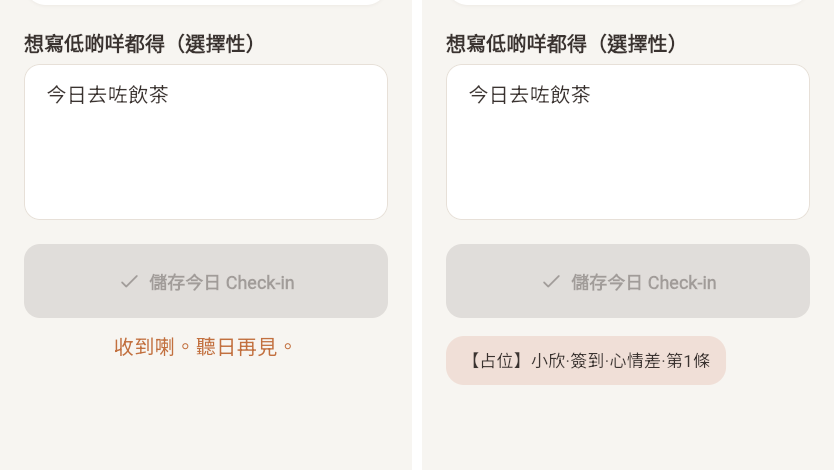
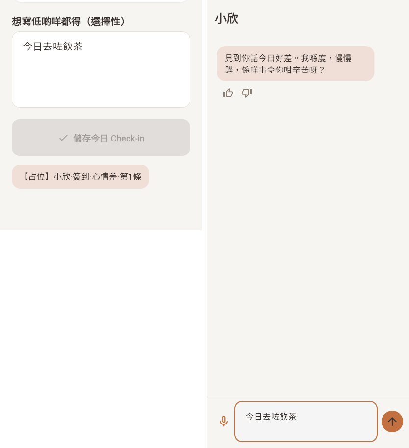
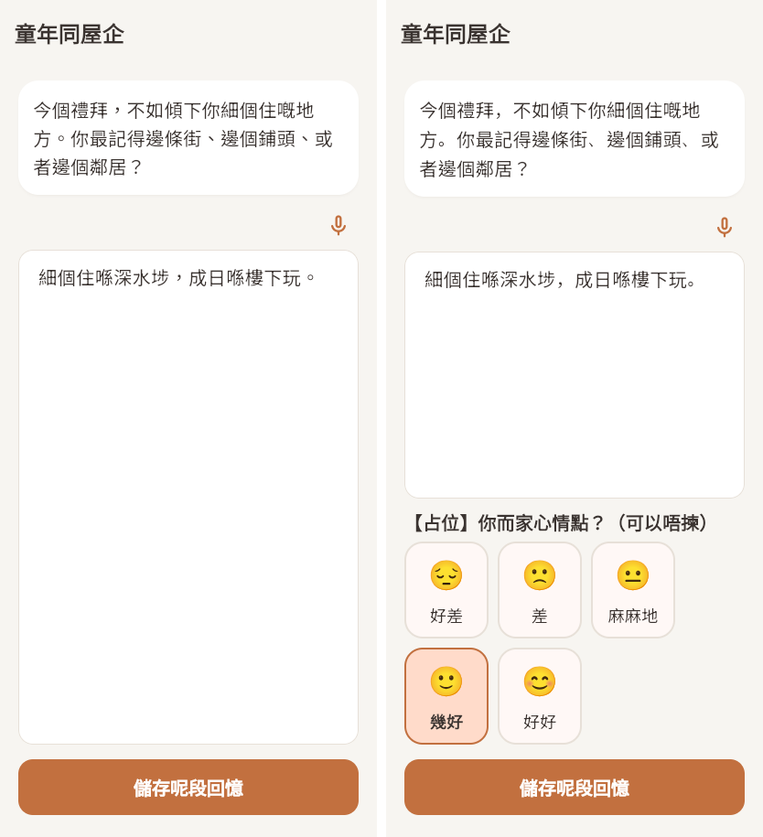
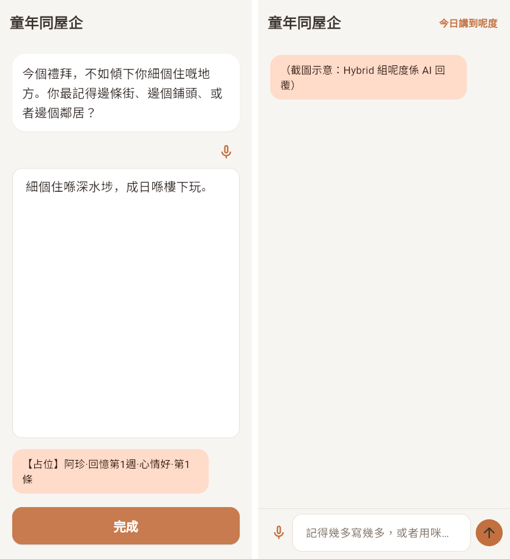

# T15 规则组阿珍、小欣的模板回应（SPEC:C02）

日期：2026-10-07　分支：`feat/rule-based-replies`　决策记录：`docs/decisions/0023-rule-arm-template-replies.md`

## 结论

- 规则组小欣签到、阿珍/阿伯回忆提交后，可以按心情从模板池给一条回应，样式和 Hybrid 组同一页面的陪伴者气泡一样。不调用任何 LLM。
- 全部放在开关后面，**默认关**。关时两个页面和现在完全一样（有测试和截图对照）；Hybrid 组没有改动。
- 模板现在全是【占位】文字。只要还有占位，正式包即使开了开关也不生效。
- 命中安全内容（moderate 或 acute）时不给模板，走现有安全流程。
- 两套测试都通过（见「测试」）。

## 开关

| 开关 | 默认 | 作用 |
|---|---|---|
| `--dart-define=RULE_TEMPLATE_REPLIES=true` | 关 | 打开模板回应（`lib/core/feature_flags/feature_flags.dart` `ruleTemplateReplies`） |
| `--dart-define=RULE_TEMPLATE_REPLIES_ALLOW_PLACEHOLDER=true` | 关 | 允许用占位模板。只用于截图和测试，不能用于发布 |

页面实际读的是 `RuleReplyPool.enabled`（`lib/features/rule_replies/data/rule_reply_pool.dart`）= 第一个开关开 且（模板没有占位 或 第二个开关开）。

## 1. 两组现在有没有心情输入

| 页面 | Hybrid 组 | 规则组（改动前） |
|---|---|---|
| 小欣签到 | 有。今天还没记心情时，先强制选 5 个心情脸之一（`check_in_arm_a.dart` `_buildMoodGate`，约 917 行），开场白按心情 5 档各一句（`_openingLine`，约 277–340 行） | 有。同一个 5 个心情脸，必选（`check_in_arm_b.dart`，`MoodFacePicker`） |
| 阿珍/阿伯回忆 | **没有**心情输入（`reminiscence_arm_a_page.dart` 里没有心情相关代码） | 没有 |

心情脸组件是两组共用的 `MoodFacePicker`（`lib/features/context/presentation/pages/check_in_shared.dart`）：5 档，😔 好差 / 🙁 差 / 😐 麻麻地 / 🙂 幾好 / 😊 好好，记 1–5。

**做法**：
- 签到 B 不加新输入，直接用已有的必选心情脸。
- 回忆 B 开关开时，在输入框下面加同一个心情脸，**选填**。和 Hybrid 的差别：Hybrid 回忆没有心情输入，这是新的界面差别，要研究侧确认。
- 模板子池按 3 档分（差 = 1–2，中 = 3，好 = 4–5，另有「未选」档给回忆用）。Hybrid 签到开场白是 5 档。档位映射写在模板文件的 `moodBands` 里，改 5 档只改数据。

## 2. 回应怎么选（规则写死）

- 子池 = 陪伴者 × 主题 × 心情档。主题：小欣 `check_in`；阿珍 `w1`–`w4`（每周回忆主题）。
- 子池里按列表顺序选第一条「本人最近 3 次没出现过」的；全出现过就选最久之前出现的。代码：`lib/features/rule_replies/data/rule_reply_picker.dart`。
- 最近记录存 `users/{uid}/rule_reply_history/{agentId}`（`recent` 最近 3 个模板编号、`pool_version`、`updated_at`）。用户子集合本来就允许本人读写，没有改 Firestore 规则。读不到（离线、未登录，等 2 秒超时）就当没有记录。代码：`rule_reply_history_store.dart`。
- 记录：回复文字写进这次会话的 `turns`（`llmStatus: rule_based`，和决策 0015 一样）；另记分析事件 `rule_template_reply`（`agent_id`、`module_id`、`template_id`、`pool_version`、`theme`、`mood_band`、`mood`）。代码：`rule_reply_service.dart`。

## 3. 安全检测

- 集中在 `lib/features/rule_replies/rule_reply_safety.dart`，两个函数，写成 T7 `SafetyService`（PR #34，`lib/core/safety/safety_check.dart`）的用法：
  - `ruleReplyDetect(context, text)` ↔ `SafetyService.detect`：先检测，决定给不给模板；
  - `ruleReplyCheckAndRoute(context, text, inputPoint:, uid:, agentId:, sessionId:)` ↔ `SafetyService.checkAndRoute`：写 `safety_events`（moderate 以上）、acute 打开危机页、moderate_interrupt 弹支援面板。`inputPoint` 用 T7 的代码 `check_in_note` / `reminiscence_note`。
- ~~现在内部用的仍是签到 B、回忆 B 原来的路径~~。**合并更新（2026-10-07）**：和 T7 合成一个 PR 时已改为调用 `SafetyService`：签到 B、回忆 B 在保存前用 `checkUserText` 检测并写一条事件（两种路径都一样，不再另写 `rule_turn` 事件），之后只做路由；`rule_reply_safety.dart` 的两个函数改为直接委托 `SafetyService`。
- 命中 = moderate_review、moderate_interrupt、acute（即会写 `safety_events` 的等级）。命中时不给模板、不记最近记录，安全流程照旧。`low` 不算命中。
- 开关关时页面仍走原来的写法（先写安全事件、最后路由），一行没变。

## 4. 显示位置和样式

- 签到 B：回应气泡出现在「儲存今日 Check-in」按钮下面，替代原来的「收到喇。聽日再見。」。颜色、圆角、字号照 Hybrid 签到的小欣气泡（`surfaceContainerHighest`，圆角 18，17 号字）。
- 回忆 B：回应气泡出现在输入框下面；页面不再自动关闭，按钮变成「完成」（沿用 App 里已有的文字），点了才关闭并按原规则弹 Brief PR。颜色照 Hybrid 回忆的阿珍气泡（`secondaryContainer`）。
- 气泡组件：`lib/features/rule_replies/presentation/rule_reply_bubble.dart`。

## 5. 模板文件和格式

文件：`lib/features/rule_replies/data/rule_reply_pool.dart`（格式参照通通的 `tung_tung_rule_pool.dart`：写死的列表 + 版本号）。

每条：

```dart
(id: 'aj_w1_low_1', agent: 'ah_jan_ah_bak', theme: 'w1', band: 'low',
  zh: '【占位】阿珍·回憶第1週·心情差·第1條',
  en: '[PLACEHOLDER] Ah Jan · reminiscence week 1 · low mood · #1'),
```

| 字段 | 说明 |
|---|---|
| `id` | 唯一、不改，分析时用 |
| `agent` | `siu_yan` / `ah_jan_ah_bak` |
| `theme` | 小欣 `check_in`；阿珍 `w1`–`w4` |
| `band` | `low` / `mid` / `high`；阿珍另有 `none`（没选心情） |
| `zh` / `en` | 回应文字。不能引用老人写的内容；阿珍和阿伯共用，不要写自称 |

现有条数：小欣 3 档 × 3 条 = 9；阿珍 4 周 × 4 档 × 2 条 = 32；共 41 条，全部以【占位】开头。改任何一条都要改 `version`（现为 `2026-10-v0-placeholder`）。`recentWindow`（不重复次数，现为 3）也在这个文件里。

## 6. 老人看得到的新文字（草稿，待研究侧定稿）

代码里现在都是占位。

| 位置 | 代码里的占位 | 草稿 |
|---|---|---|
| 回忆 B 心情脸上方的提示 | 【占位】你而家心情點？（可以唔揀） | 寫完之後，你而家心情點？（唔揀都得） |
| 小欣签到 · 心情差 | 【占位】… | 多謝你話我知。辛苦嘅日子，慢慢嚟，聽日我再問候你。 |
| 小欣签到 · 心情中 | 【占位】… | 收到喇。平平淡淡都係一日，聽日再見。 |
| 小欣签到 · 心情好 | 【占位】… | 聽到你今日唔錯，真係開心。聽日再見。 |
| 阿珍回忆 · 心情差 | 【占位】… | 多謝你同我分享呢段回憶。諗返以前，有時都會唔好受，慢慢嚟。 |
| 阿珍回忆 · 心情中 / 未选 | 【占位】… | 多謝你寫低呢段回憶，我會好好留住佢。 |
| 阿珍回忆 · 心情好 | 【占位】… | 呢段回憶聽落好溫暖，多謝你同我分享。 |

「完成」按钮沿用 App 里已有的文字，没有新写。

## 7. 测试

| 测试 | 内容 |
|---|---|
| `test/rule_reply_pool_test.dart` | 编号唯一；每个子池都不空；全部是占位、默认不生效；心情档映射；近 3 次不重复、全用过选最久的；moderate / acute 挡住模板、low 不挡 |
| `test/rule_reply_pages_test.dart` | 开关关：签到 B 显示原来那句、没有气泡；回忆 B 没有心情脸、提交后自动关闭。开关开：签到 B 按心情出气泡；acute 进危机页、不出模板、不记录；moderate 不出模板；回忆 B 心情选填、出气泡、点「完成」关闭；没选心情用「未选」子池；回忆 acute 进危机页。全部不调用 LLM |
| `tool/ci_flutter_tests.sh` | 新增两套：只开 `RULE_TEMPLATE_REPLIES`（验证占位保护，页面应和关时一样）；两个开关都开 |

推送前结果：`tool/ci_flutter_tests.sh` 六套全部通过；`tool/ci_backend_tests.sh` 全部通过。

## 8. 截图（Flutter web + Chromium）

截图用单独的入口 `T15-rule-based-replies-20261007-screenshots/t15_screens_main.dart` 渲染页面（离线假服务，不连 Firebase），`t15_shots.js` 用 Playwright 操作。Hybrid 那一侧的 AI 文字是固定的示意文字，没有调用 LLM。

| 图 | 左 | 右 |
|---|---|---|
|  | 签到 B，开关关（原来那句） | 签到 B，开关开（模板气泡） |
|  | 签到 B，开关开 | 签到 Hybrid（小欣气泡，同色） |
|  | 回忆 B，开关关 | 回忆 B，开关开（多了选填心情脸） |
|  | 回忆 B，开关开，提交后（气泡 +「完成」） | 回忆 Hybrid（阿珍气泡，同色） |

## 9. 和别的任务的交叉

- 改了 `lib/core/feature_flags/feature_flags.dart`（加两个开关），T9 也会加开关，合并时可能有小冲突。
- 改了 `tool/ci_flutter_tests.sh`、`CLAUDE.md`（「四套」改成「多套」）。
- 没有改 `lib/core/safety/`，没有改 Firestore 规则。

## 要带回研究侧的发现

1. **模板正文**：41 条全是占位，需要研究侧写定并做文化审阅；格式见第 5 节，草稿见第 6 节。
2. **回忆 B 多了心情输入**，Hybrid 回忆没有。这是两组界面的新差别，要不要接受、要不要写进 Methods。
3. **心情选填还是必选**（回忆 B）。现在是选填，没选用「未选」子池。
4. **心情档**：现在 5 档归 3 档。Hybrid 签到开场白是 5 档，要不要对齐成 5 档（只改数据）。
5. **哀伤回忆不出模板**：回忆里讲到过世、旧日艰难，常命中 moderate_review。按任务单「命中就不给模板」，这些提交现在没有回应。是否改成 moderate_review 照常给模板。
6. **打开时间**：开关打开后，已入组的规则组参与者会在研究中途看到新回应。要定是否只对新 cohort 打开，并在 STUDY_CHANGELOG 记生效日期。
7. **回忆 B 的流程变了**：开关开时提交后不再自动关闭，要点「完成」。Brief PR 在点「完成」后弹出。
