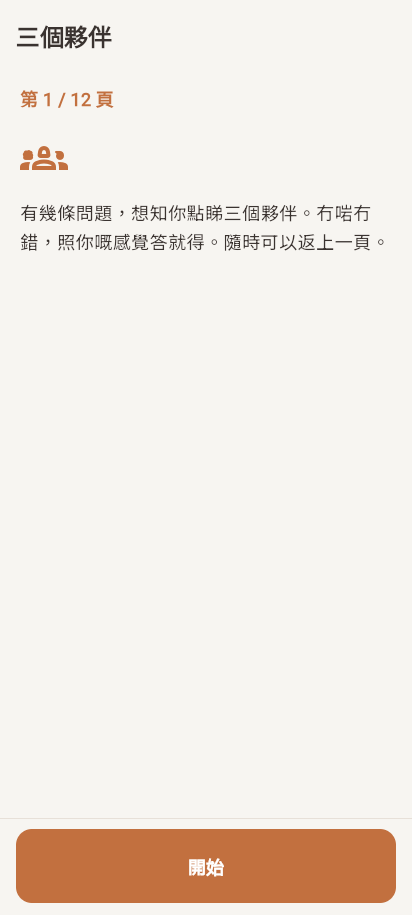
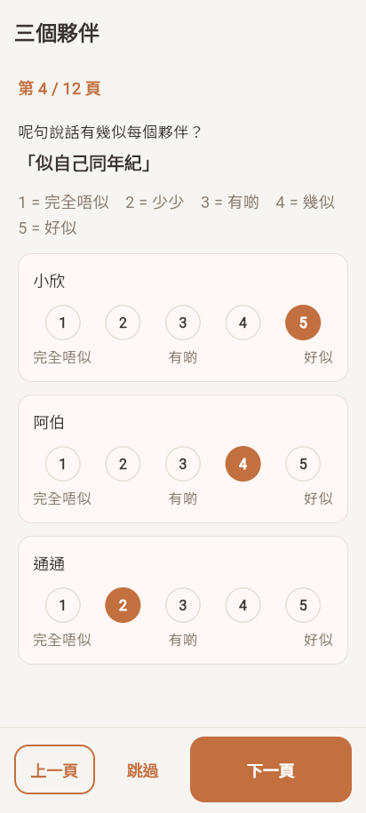
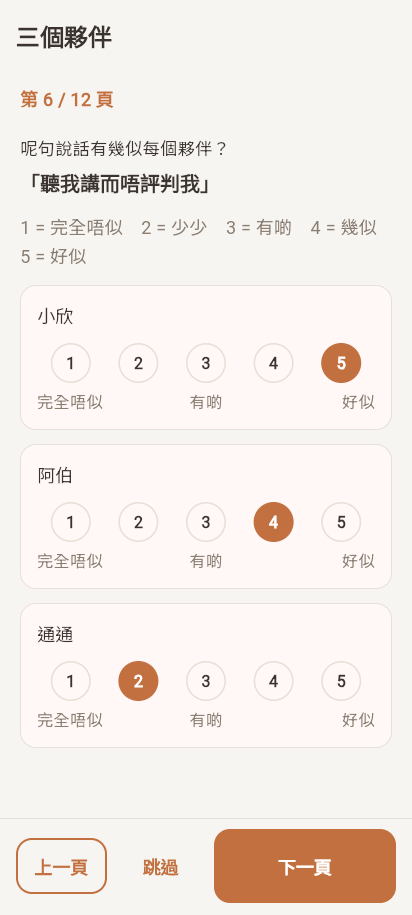
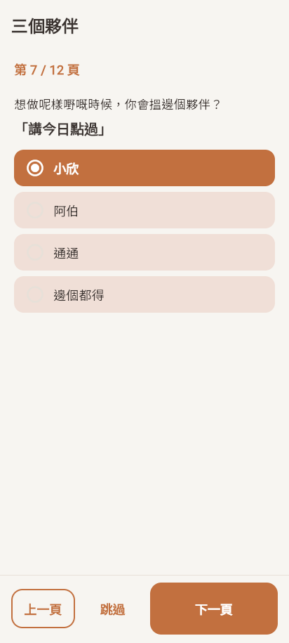
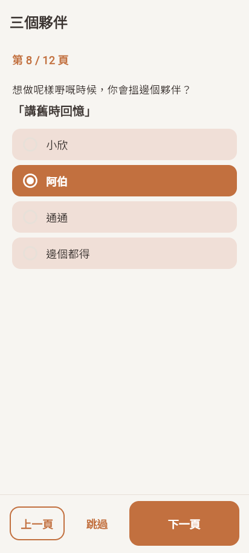
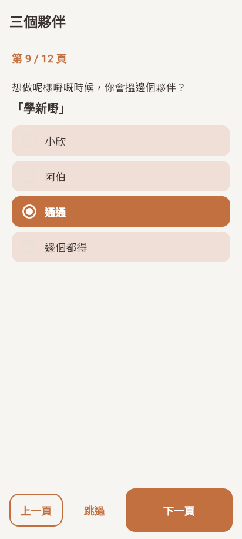
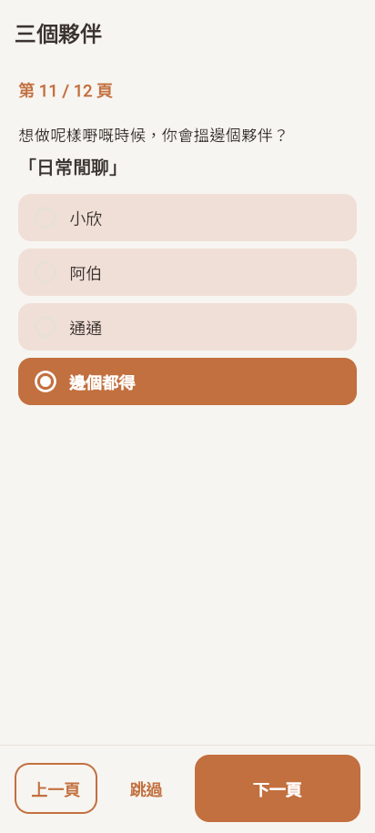
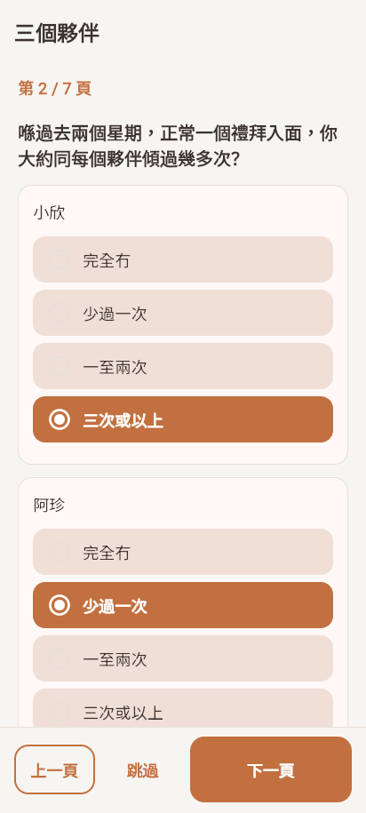
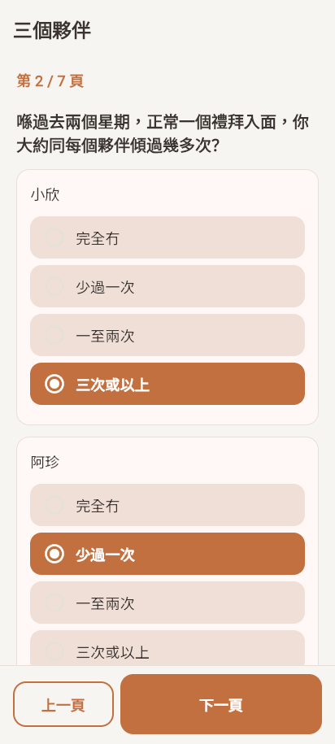
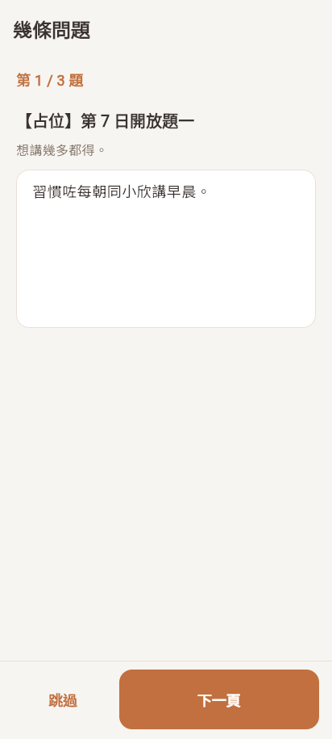

# T17 ADA 进 App（SPEC:C22）— 报告

日期：2026-10-07。分支 `feat/ada`。决策记录：`docs/decisions/0026-ada-phase-a-only-new-collection.md`。

## 结论

- **新做，不改旧的**。App 里已有的“陪伴者区分评估”（agent_diff）和附件 C 结构差别大（见第 1 节），改它会让新旧数据混在一个集合里，而且它在 Phase B 盲法导出白名单里。新 ADA 存独立集合 `ada_responses`，旧页面、旧集合、旧数据都没动。
- **只在 Phase A**：`PHASE_B=true` 的包里看不到 ADA 和第 7 日开放题，配置写什么都没用。Phase A 包里也是**默认关**，研究侧在 `app_config/phaseA_schedule` 打开才出现。
- **Phase B 里旧 agent_diff 默认关掉**（登记表 v2 C15 不含 ADA），开关 `LEGACY_AGENT_DIFF_PHASE_B` 可恢复。
- 题目、回忆窗口、时间点都是**占位**，等研究侧定稿和 EA260417 批复。
- 两套测试全过（第 7 节）。

## 1. 现状：旧 agent_diff 和附件 C 的差别

旧页面 `lib/features/assessment/presentation/pages/agent_diff_page.dart`，数据模型 `lib/features/assessment/data/agent_diff_response.dart`，触发 `lib/core/scheduling/pending_prompts_service.dart`。

| 项目 | 旧 agent_diff | 附件 C / 任务单要求 |
|---|---|---|
| 时间点 | 入组第 14–16 天（第 2 周）、第 28 天起（第 4 周，没有截止） | Phase A 第 1 次到访当场、第 7 日，可配置 |
| 用在哪 | 两组、Phase A 和 Phase B 两种包都出现 | 只用于 Phase A |
| 短版 / 全版 | 按周数写死：第 2 周没有 C，第 4 周有 C | 可配置：短版 A+B+D，全版 A+B+C+D |
| 回忆窗口 | 写死“喺過去兩個星期，正常一個禮拜入面” | 可配置 |
| 一屏一项 | A、B、C 各一页大矩阵 | 一个特质或一个情境一屏 |
| 跳过 | 没有跳过；B、C 必须全答才能提交 | 可配置，默认允许，记“跳过” |
| 每屏保存 | 不保存，按返回离开就丢 | 每屏保存 |
| A 的默认值 | 三个陪伴者默认都选“完全冇”（`_usageFreq` 初值 0），不点也会存 0 | 没有默认值 |
| D 题 | 「仲有咩想補充？」，选填 | 三个 agent 有咩唔同、会同边个倾得多啲、点解 |
| D 的输入方式 | 不记录 | 记录打字 / 语音 |
| 字段 | `wave`、`timepoint`（week2/week4）、`usageFreq`、`personality`、`function`、`freeResponse`、`answeredAt` | 研究编号、表单版本、时间点、每题原始值、开始和提交时间、输入方式 |
| 存储 | `users/{uid}/agent_diff`，在盲法导出白名单里（`functions/blinding.js` `OUTCOME_COLLECTIONS`） | 独立集合；ADA 不进 Phase B 盲法导出 |
| 阿珍 / 阿伯 | 按资料里的 `ahJanAhBakVariant` 显示 | 同左 |
| 安全检测 | D 经 `SafetyService`（输入点 `agent_diff`） | 同左 |

题目来源相同（4 个特质、5 个情境、4 档频率），所以新页面沿用了同样的题目编号（`warm`、`day_recap` 等）。

## 2. 做了什么

| 内容 | 位置 |
|---|---|
| ADA 页面：一屏一项，可返回，每屏保存，可跳过 | `lib/features/ada/presentation/ada_page.dart` |
| 第 7 日 3 道开放题 | `lib/features/ada/presentation/day7_open_page.dart` |
| 长文字组件（ADA 的 D 和开放题共用；麦克风跟随语音开关） | `lib/core/survey/long_text_answer.dart` |
| 底部按钮（上一頁 / 跳過 / 下一頁）和提示条 | `lib/features/ada/presentation/survey_nav_bar.dart` |
| 题目结构和占位文字 | `lib/features/ada/data/ada_items.dart` |
| 配置（只属于 Phase A） | `lib/core/config/phase_a_schedule_config.dart` |
| 谁能看到什么（Phase A / B、旧入口） | `lib/features/ada/data/ada_gate.dart` |
| 每屏保存（Firestore / 内存两种实现） | `lib/features/ada/data/survey_draft_store.dart` |
| 首页横幅 | `lib/core/scheduling/pending_prompts_service.dart`、`lib/features/today/presentation/widgets/pending_prompts_banner.dart` |
| 测试员预览按钮（短版、全版、第 7 日；Phase B 包不显示） | `lib/features/settings/presentation/pages/settings_page.dart` |
| 启动时读配置（Phase B 包不读） | `lib/main.dart` |

- **阿珍 / 阿伯**：用资料里已有的 `ahJanAhBakVariant` 和 `AgentRegistry.ahJanAhBakName`（`lib/core/agents/agent_registry.dart`），没有另建字段。资料里没有性别时显示「阿珍／阿伯」。
- **跳过**：开着时每屏有「跳過」。本屏没答的题记 `"skipped"`；D 没写字就记 `freeTextStatus: "skipped"`。没答完按「下一頁」会在按钮上方出现提示条，不前进。提示没用 SnackBar，因为它会盖住「跳過」按钮。
- **续答**：草稿记着上次停在哪一屏（`lastScreen`），再打开从那里接着做。提交后再打开只显示“已经储存”。
- **入组第几天**：沿用 `lib/core/scheduling/enrolment_day.dart`（第 1 天 = 账号创建那天）。

## 3. 开关和配置项

**这些键只属于 Phase A**，都在 `app_config/phaseA_schedule` 一份文档里，T21 迁移时整份搬走即可。Phase B 包不读这份文档（`lib/main.dart`），也不按它显示（`ada_gate.dart`）。

| 键 | 类型 | 默认 | 作用 |
|---|---|---|---|
| `adaEnabled` | bool | **关** | Phase A 包首页显示 ADA 横幅。必须是 `true` 才算开 |
| `adaAllowSkip` | bool | 开 | ADA 每屏显示「跳過」 |
| `adaTimepoints` | 列表 | 见下 | 每次施测：`id`（存为时间点，也是文档编号）、`form`（`short` / `full`）、`dayFrom`、`dayTo`（入组第几天，含两端）、`recallWindowZh`、`recallWindowEn` |
| `day7OpenEndedEnabled` | bool | **关** | 显示第 7 日开放题横幅 |
| `day7OpenEndedDayFrom` / `day7OpenEndedDayTo` | 整数 | 7 / 9 | 开放题横幅出现的入组天数 |
| `day7OpenEndedAllowSkip` | bool | 开 | 开放题每屏显示「跳過」 |

`adaTimepoints` 默认（占位，等 EA260417）：

```json
[
  {"id": "visit1", "form": "short", "dayFrom": 1, "dayTo": 1},
  {"id": "day7",   "form": "full",  "dayFrom": 7, "dayTo": 9}
]
```

回忆窗口默认是 v1.3 的「喺過去兩個星期，正常一個禮拜入面」。

**编译开关**（`lib/core/feature_flags/feature_flags.dart`）：

| 开关 | 默认 | 作用 |
|---|---|---|
| `--dart-define=LEGACY_AGENT_DIFF_PHASE_B=true` | 关 | Phase B 包里恢复旧 agent_diff（第 14、28 天）。Phase A 包不看它 |

**谁看得到什么**（`lib/features/ada/data/ada_gate.dart`）：

| 构建 | 新 ADA / 第 7 日开放题 | 旧 agent_diff |
|---|---|---|
| Phase A（默认） | `adaEnabled` / `day7OpenEndedEnabled` 打开时 | `adaEnabled` 关时照旧；打开后不再显示（避免同一个人做两次相近的问卷） |
| `PHASE_B=true` | 永远不显示 | 默认不显示；`LEGACY_AGENT_DIFF_PHASE_B=true` 时照旧 |

语音：沿用 T9 的 `app_config/feature_flags.voiceInputEnabled`（`lib/core/feature_flags/remote_feature_flags.dart`）。关时只有输入框，没有麦克风，也没有“或者用講嘅”。

## 4. 数据字段表

### `users/{uid}/ada_responses/{时间点}`

| 字段 | 内容 |
|---|---|
| `schemaVersion` | 1 |
| `instrument` | `"ada"` |
| `studyPhase` | `"A"`（方便 T21 按研究期筛选） |
| `uid` | 参与者 uid。**不是研究编号**，见下 |
| `timepoint` | 时间点编号，如 `visit1`、`day7`；等于文档编号 |
| `formVersion` | `short`（A+B+D）或 `full`（A+B+C+D） |
| `itemsVersion` | 题目版本，现为 `ada-placeholder-20261007` |
| `recallWindowZh` | 当时显示的回忆窗口文字 |
| `allowSkip` | 当时是否允许跳过 |
| `ahJanAhBakVariant` | `feminine`（阿珍）/ `masculine`（阿伯）/ 空 |
| `enrolmentDay` | 入组第几天（从首页横幅进入时有；测试员预览为空） |
| `screenCount` / `lastScreen` | 总屏数（短版 7，全版 12）/ 最后停在哪一屏（从 0 起） |
| `usage.{agentId}` | A：0 完全冇、1 少過一次、2 一至兩次、3 三次或以上，或 `"skipped"` |
| `traits.{traitId}.{agentId}` | B：1 完全唔似 … 5 好似，或 `"skipped"`。特质：`warm`、`same_age`、`curious`、`non_judgmental` |
| `scenarios.{scenarioId}` | C（只有全版）：`siu_yan` / `ah_jan_ah_bak` / `tung_tung` / `any`（邊個都得），或 `"skipped"`。情境：`day_recap`、`memories`、`learn_new`、`feeling_down`、`small_talk` |
| `freeText` | D 的文字；没写为空 |
| `freeTextStatus` | `answered` / `skipped` / 空（还没到 D） |
| `freeTextInputMode` | `typed` / `voice`（只要用过一次语音就记 `voice`） |
| `freeTextVoiceMs` | 用语音的毫秒数 |
| `status` | `in_progress` / `submitted` |
| `startedAt` | 按「開始」的时间（手机时间，第一次保存时写，之后不改） |
| `updatedAt` | 每次保存的服务器时间 |
| `submittedAt` | 提交的服务器时间 |

还没到的题不出现在文档里；跳过的题是 `"skipped"`，两者可以区分。

### `users/{uid}/day7_open_responses/day7`

| 字段 | 内容 |
|---|---|
| `schemaVersion`、`instrument`（`"day7_open"`）、`studyPhase`、`uid`、`timepoint`（`day7`）、`itemsVersion`（`day7-open-placeholder-20261007`）、`allowSkip`、`enrolmentDay`、`lastScreen`、`status`、`startedAt`、`updatedAt`、`submittedAt` | 同上 |
| `answers.q1` / `q2` / `q3` | `{text, status: answered / skipped, inputMode: typed / voice, voiceMs}` |

### 研究编号

T12 的研究编号只在服务器上生成，存在 `research_id_map` / `research_ids`，App 读不到（决策 0021，`functions/blinding.js` 文件开头说明）；而且只在盲法开关打开、分组时才生成。Phase A 下 App 拿不到编号，所以**文档里存 uid**。Phase A 导出时由服务器用 `ensureResearchId`（`functions/blinding.js`）换成编号。

## 5. 安全、规则、删除、导出

- **安全检测**：D 和每道开放题的文字在保存时经 `SafetyService.checkAndRoute`（`lib/core/safety/safety_check.dart`），新输入点 `ada_free_text`、`day7_open_ended`（类别 `form`，跟随 `safetyScanAllInputs`，默认开）。同一段文字只查一次。两组用的是同一个检测入口，没有改词库或检测逻辑。
- **Firestore 规则**（`firestore.rules`）：两个集合只有本人能读写；文档里的 `uid` 必须是自己、`timepoint` 必须等于文档编号；`status` 变成 `submitted` 之后不能再改；客户端不能删。通用的“本人子集合”规则把这两个集合排除在外。
- **整人删除**：`tool/delete_participant.js` 会遍历 `users/{uid}` 下所有子集合，新集合自动删到；文件开头的说明已写上这两个集合，测试 `test/delete_participant/delete_participant_test.js` 加了两个集合的种子数据并检查删干净。
- **盲法导出**：新版导出只导出白名单（`functions/blinding.js` `OUTCOME_COLLECTIONS`），旧版导出也是固定列表（`functions/index.js` `_EXPORT_BLINDED_COLLECTIONS`），两者都没有加 ADA。检查工具 `tool/check_blinded_export.js` 遇到不在白名单的文件会报错；`functions/test/blinding_test.js` 加了测试确认 ADA 文件会被报出来。

## 6. Phase B 里的旧入口

现状：旧 agent_diff 在 Phase B 包里第 14 天（和 DJG 一起）和第 28 天会出现，和 v2 C15 不符。

改为：Phase B 包默认不显示（首页横幅、测试员页面的入口都按 `AdaGate.legacyAgentDiffVisible`）。第 2 周横幅只剩 DJG，副标题从「幾分鐘：最近嘅感受，同三個夥伴嘅比較。」改成「幾分鐘：最近嘅感受。」（草稿）。服务器的第 2 周推送（`week2Push`）不变，因为 DJG 还在。已有的 agent_diff 数据和集合没动。已写进 `docs/STUDY_CHANGELOG.md`。

## 7. 测试

| 测试 | 内容 | 结果 |
|---|---|---|
| `test/ada_test.dart`（默认包） | 配置解析（只有 `true` 才开、时间点可配）；Phase A/B 显示矩阵；短版 7 屏走完并核对每个字段；全版 12 屏、阿伯（全程不出现阿珍）、情境和 D 跳过记 `"skipped"`；没答完有提示不前进、跳过补记；不允许跳过时没有按钮；草稿续答且不改 `startedAt`；语音关没有麦克风、开有麦克风；D 经 `SafetyService` 写 `ada_free_text`；第 7 日 3 屏保存、跳过、提交 | 15 项全过 |
| `test/ada_test.dart`（`PHASE_B=true`） | 同上，加上“真实编译开关”：Phase B 包里配置全开也看不到 ADA 和开放题，旧 agent_diff 默认关 | 15 项全过 |
| `test/safety_check_test.dart` | 两个新输入点各一句合成句，确认检测、写事件、带 `inputPoint` | 全过 |
| `test/rules/ada_rules.test.js`（模拟器） | 合成数据跑短版、全版：逐屏保存、提交、提交后改和删被拒；草稿不能删；uid / 时间点 / 状态不符被拒；别人读写被拒；未登录被拒；旧集合不受影响 | 全过 |
| `test/delete_participant/delete_participant_test.js`（模拟器） | 两个新集合被列出并删干净，别人的不动 | 全过 |
| `functions/test/blinding_test.js` | ADA 不在导出白名单；检查工具会报出 ADA 文件 | 全过 |
| **全套** `tool/ci_backend_tests.sh` | Functions + 规则 + 模拟器 + 删除脚本 | 全过（规则测试 65 项） |
| **全套** `tool/ci_flutter_tests.sh` | 六套构建变体（Phase B 那套新加 `test/ada_test.dart`） | 六套全过（默认包 306 项通过、21 项跳过，跳过的是原有测试） |

说明：页面测试用的是内存存储（`InMemorySurveyDraftStore`），因为项目里没有 Flutter 连 Firestore 模拟器的测试设施；Firestore 一侧用规则测试在模拟器上按页面写入的同样字段跑了短版和全版。首页横幅的 Firestore 查询（`pending_prompts_service.dart`）没有单测，它的判断都交给 `AdaGate`，已测。

## 8. 截图（Flutter web + Chromium，合成数据）

入口 `T17-ada-20261007-screenshots/t17_screens_main.dart`（内存存储，不连 Firebase），`t17_shots.js` 用 Playwright 逐屏截图。

全版（阿伯，语音关）每一屏：

| 1 开始 | 2 A 使用频率 | 3 B 温暖 | 4 B 同年纪 |
|---|---|---|---|
|  |  |  |  |
| **5 B 好奇** | **6 B 不评判** | **7 C 今日点过** | **8 C 旧时回忆** |
|  |  |  |  |
| **9 C 学新嘢** | **10 C 心情唔好** | **11 C 日常闲聊** | **12 D 自由作答** |
|  |  |  |  |

短版和其他状态：

| 短版 A（阿珍） | 短版 D，语音关 | 短版 D，语音开 | 不允许跳过 |
|---|---|---|---|
|  |  |  |  |
| **提交后** | **第 7 日 第 1 题** | **第 7 日 第 2 题** | **第 7 日 第 3 题，语音开** |
|  |  |  |  |

短版的 B 屏和全版一样（只是页码是 /7），没有重复截。

## 9. 老人看得到的文字（全部是草稿，等研究侧定稿）

| 位置 | 草稿 |
|---|---|
| ADA 开始页 | 有幾條問題，想知你點睇三個夥伴。冇啱冇錯，照你嘅感覺答就得。隨時可以返上一頁。 |
| A 题干 | {回忆窗口}，你大約同每個夥伴傾過幾多次？（选项：完全冇 / 少過一次 / 一至兩次 / 三次或以上） |
| B 题干 | 呢句說話有幾似每個夥伴？「溫暖、關心人」「似自己同年紀」「好奇、鍾意問嘢」「聽我講而唔評判我」；1 = 完全唔似、2 = 少少、3 = 有啲、4 = 幾似、5 = 好似 |
| C 题干 | 想做呢樣嘢嘅時候，你會搵邊個夥伴？「講今日點過」「講舊時回憶」「學新嘢」「心情唔好」「日常閒聊」；选项：小欣 / 阿珍或阿伯 / 通通 / 邊個都得 |
| D 题干 | 你覺得三個夥伴有咩唔同？你會同邊個傾得多啲？點解？（提示：想講幾多都得。） |
| 第 7 日开放题 | 【占位】第 7 日開放題一 / 二 / 三 |
| 提示条 | 請揀晒每一行，或者撳「跳過」。／請寫低少少嘢，或者撳「跳過」。（不允许跳过时去掉后半句） |
| 提交后 | 多謝你！已經儲存。 |
| 首页横幅 | ADA：「三個夥伴嘅幾條問題」「幾分鐘，講下你點睇三個夥伴。」；开放题：「幾條開放問題」「用咗一個禮拜，想聽下你嘅諗法。」 |
| 第 2 周横幅（Phase B，无旧 ADA 时） | 幾分鐘：最近嘅感受。 |
| 页面标题 | 三個夥伴；幾條問題 |

文字都集中在 `lib/features/ada/data/ada_items.dart`（题目）和两个页面文件里。定稿后改 `itemsVersion`。

## 10. 要带回研究侧的发现

1. **Phase B 包里一直会弹旧的“陪伴者区分评估”**（第 14 天、第 28 天），和登记表 v2 C15“Phase B 不含 ADA”不符。本 PR 默认关掉。如果已有 Phase B 参与者（或试用者）做过，`users/{uid}/agent_diff` 里有数据，要决定算偏离还是忽略。旧数据现在仍在 Phase B 盲法导出白名单里（`functions/blinding.js`），要不要拿掉也请定。
2. **旧 agent_diff 的 A 部分默认选“完全冇”**：没点也会存 0，旧数据里的 0 可能是“没答”。新 ADA 没有默认值。
3. **ADA 定稿**：措辞（`docs/spec/instruments/ada.md` 还没有）、Phase A 新版的回忆窗口（第 1 次到访当场问“过去两个星期”不合适）、两个时间点各用短版还是全版（现默认：第 1 次短版、第 7 日全版）、第 7 日窗口几天（现默认第 7–9 天）、要不要允许跳过。
4. **“第 1 次到访当场”现在按入组第 1 天算**（账号创建那天）。如果到访不是注册当天，要改成别的触发方式（例如研究员现场打开），请说明。
5. **第 7 日 3 道开放题**的题目还没有；D 部分和开放题的文字有自由作答，已接安全检测。
6. **研究编号**：Phase A 下 App 拿不到 T12 的研究编号，ADA 存 uid。Phase A 导出时需要服务器换成编号（T21 一起做）。
7. **Phase A 打开 ADA 后旧 agent_diff 不再出现**，避免同一个人在第 14 天又做一次相近的问卷。如果 Phase A 仍要第 14、28 天的旧问卷，请说明。
8. **D 的输入方式**只分“打字”和“语音”，用过一次语音就记语音，没有区分“混合”。需要更细请说明。
9. 第 2 周横幅副标题、ADA 和开放题横幅、页面上的所有文字都是草稿（第 9 节）。
