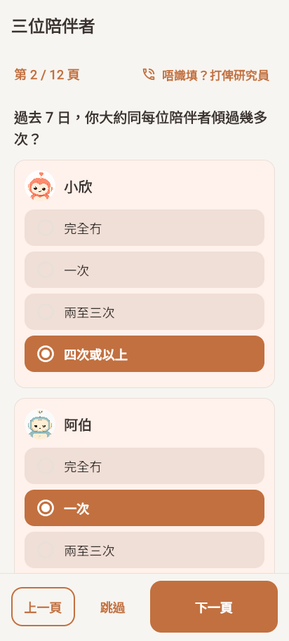
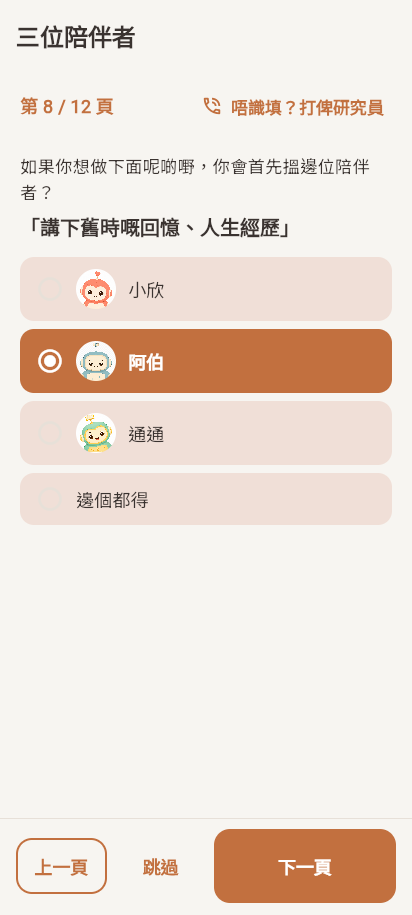
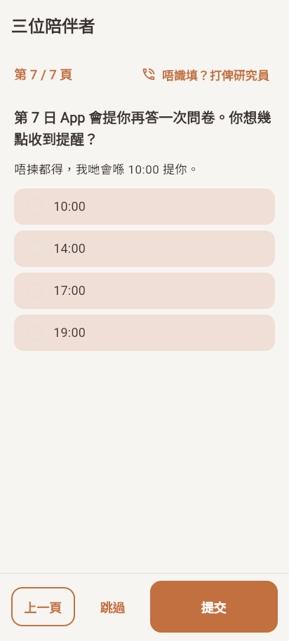
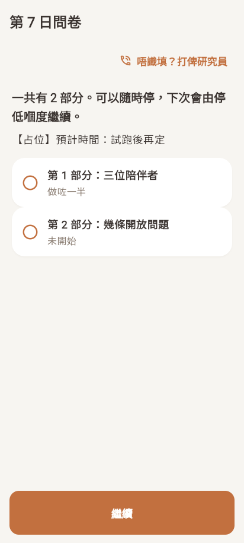
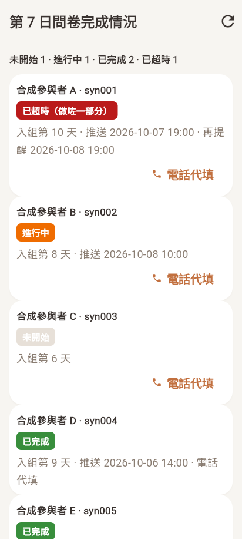

# T17b ADA 按定稿规格补做（SPEC:C22）— 报告

日期：2026-10-07。分支 `feat/ada-v1`。依据 `docs/spec/instruments/ada.md` v1.0。决策记录 0030（补充 0026）。

## 结论

- ada.md 第 2–9 节都做了，逐条见第 2 节。题目照抄，版本号换成 `ada-v1.0-20261007`，旧占位数据不动。
- **开关 `adaEnabled`、`day7OpenEndedEnabled` 仍默认关。PI 书面确认截图前不打开。**
- 老人看得到的新文字（推送、提醒时间页、流程说明、求助弹窗等）都是草稿；推送带【占位】，定稿前服务器不发。
- 和任务单不同处按 ada.md 做：第 1 次到访短版是 B + D，不是 A + B + D。
- 两套测试全过（第 5 节）。

## 1. 开关和配置

全部在 `app_config/phaseA_schedule`（只属于 Phase A；App 读 `lib/core/config/phase_a_schedule_config.dart`，服务器读 `functions/ada.js`）。Phase B 构建不看这份文档，也不显示任何入口。

| 键 | 默认 | 作用 |
|---|---|---|
| `adaEnabled` | **关** | ADA（第 1 次到访短版、第 7 日第 1 部分） |
| `day7OpenEndedEnabled` | **关** | 第 7 日第 2 部分（开放题） |
| `adaTimepoints` | `visit1` 第 1 天短版；`day7` 第 7–9 天全版 | 每次施测的编号、版本、天数。第 7 日窗口（推送、超时）按 `day7` 这一项 |
| `adaAllowSkip` / `day7OpenEndedAllowSkip` | 开 | 每屏有「跳過」 |
| `adaHelpPhone` | 空 | 求助按钮拨的号码 |
| `adaDay7ReminderTimeOptions` | 10:00、14:00、17:00、19:00 | 第 1 次到访最后给老人选的时间（整点，08–21 点） |
| `adaDay7ReminderDefaultTime` | 10:00 | 老人没选时用 |
| `adaDay7ReminderHours` | 24 | 第一次推送后多少小时没做完再推 |
| `day7FlowMinutes` | 空 | 第 7 日开头显示的预计分钟数；空 = 显示【占位】 |

`day7OpenEndedDayFrom` / `DayTo` 只在没有 `day7` 时间点时才用。T17 的 `recallWindowZh/En` 不再使用（题干固定"過去 7 日"）。

## 2. 逐条对照 ada.md

| ada.md | 做了什么 | 文件 |
|---|---|---|
| §1 / §3 题目照用 | A、B、C、D 题干和选项逐字照抄；B 编号 B1–B4、C 编号 C1–C5 有对照表；英文只是 App 英文界面的工作翻译 | `lib/features/ada/data/ada_items.dart` |
| §3 A 选项存 0–3 | 完全冇 0 / 一次 1 / 兩至三次 2 / 四次或以上 3 | 同上；`ada_page.dart` |
| §3 名字旁放头像 | A、B 每个陪伴者一张卡，卡头是头像 + 名字；C 每个选项前有头像（「邊個都得」没有）。用现有 `assets/agents/*_avatar.png` | `lib/features/ada/presentation/ada_widgets.dart` |
| §3 阿珍/阿伯按配对 | 用资料里的 `ahJanAhBakVariant`。没有配对时显示「阿珍／阿伯」（C 选项「阿珍（或阿伯）」），头像用中性图标，不猜 | `ada_widgets.dart` |
| §3 `itemsVersion` | 新版本 `ada-v1.0-20261007`；旧 `ada-placeholder-20261007` 的数据不动 | `ada_items.dart` |
| §2 时间和版本 | 短版 = B + D，全版 = A + B + C + D；默认 visit1 第 1 天短版、day7 第 7–9 天全版，都从配置读 | `phase_a_schedule_config.dart`（`AdaForm.hasUsage/hasScenarios`） |
| §4.1 一屏一项 | B 一个句子一屏、三个陪伴者同屏打分；C 一个情境一屏；可返回，每屏保存 | `ada_page.dart` |
| §4.2 可跳过 | 每屏「跳過」，记 `"skipped"`；页面显示「已跳過」 | 同上 |
| §4.3–4.4 原始值、不算总分 | 原始值照存；代码里没有任何总分或平均 | 同上 |
| §5 存储字段 | 见第 3 节 | `ada_page.dart`、`day7_open_page.dart`、`functions/ada.js` |
| §6.1 提醒时间 | 第 1 次到访最后一屏选时间（文字草稿）；没选记 `skipped`，用默认时间 | `ada_page.dart`（`_reminderView`） |
| §6.1 推送和再提醒 | 定时函数 `adaDay7Dispatch` 每小时（08:00–21:00）：第 7 日到老人选的整点推一次；24 小时后没做完再推一次；过第 9 日记"已超时"。推送文字【占位】时不发（同 T18）；只推 Phase A 参与者，不推测试账号 | `functions/ada.js` `dispatchAdaDay7`；`functions/index.js` |
| §6.1 首页问卷卡 | 原来 ADA 第 7 日、开放题两张卡合成一张「第 7 日問卷」，窗口内、没全部交完时出现 | `lib/core/scheduling/pending_prompts_service.dart`；`lib/features/today/presentation/widgets/pending_prompts_banner.dart` |
| §6.2 一个流程、预计时间、进度 | 第 7 日流程页：开头"一共有 N 部分"、预计时间（没配置显示【占位】）、每部分状态；每部分顶上「第 N 部分，共 M 部分」。现在两部分：ADA 全版、开放题；以后加 Weekly PR、可用性题只要在 `Day7Part` 里加一项 | `lib/features/ada/presentation/day7_flow_page.dart`；`lib/features/ada/data/ada_gate.dart` |
| §6.3 中途停、接着做 | 每部分单独一份文档、每屏保存；再打开从第一个没交的部分、停下的那一屏继续 | `day7_flow_page.dart`；`ada_page.dart`（`lastScreen`） |
| §6.4 大按钮、头像 | 选项按钮至少 52 高、18 号字；名字旁有头像 | `ada_page.dart`、`ada_widgets.dart` |
| §6.5 求助按钮 | 每屏顶上「唔識填？打俾研究員」，号码读 `adaHelpPhone`。**没配置时**：按钮照样显示，但不拨号，弹「唔緊要，可以先撳「跳過」。研究員之後會打電話俾你，幫你一齊填。」（草稿）。网页版或平板拨不出时显示号码 | `ada_widgets.dart`（`SurveyHelpButton`） |
| §6.6 电话补做 | 研究员页面「電話代填」打开同样的流程，经 Cloud Function 写入；服务器盖 `channel: "phone_by_staff"`、`staffUid`，已提交的不能再改。App 自己写的只能是 `channel: "app"`（规则检查）；研究员开始代填后老人不能再改那份文档。研究员手机上不显示麦克风 | `ada_staff_page.dart`；`survey_draft_store.dart`（`CallableStaffSurveyDraftStore`）；`functions/ada.js` `staffSave`；`firestore.rules` |
| §6.7 研究员页面 | 每个 Phase A 参与者一行：未开始 / 进行中 / 已完成 / 已超时（超时的标"做咗一部分"），入组第几天、推送和再提醒时间、完成渠道；顶上四种状态的人数。从研究员后台进入（独立文件，Phase B 构建不显示入口） | `ada_staff_page.dart`；`researcher_dashboard_page.dart`（只加一个入口）；`functions/ada.js` `staffDay7Status` |
| §7 安全 | 老人自己填：D 和开放题照旧经 `SafetyService`（`ada_free_text`、`day7_open_ended`），命中走聊天同样的流程。研究员代填：服务器用同一份词库（`functions/safety_lexicon.js`）查，命中写 `safety_events`（`source: form`、`channel: phone_by_staff`，不存原文），之后去重和 acute 通知 PI 走原来的触发器；研究员屏幕弹「按研究安全流程跟进」。`lib/core/safety/` 没改 | `ada_page.dart`、`day7_open_page.dart`；`functions/ada.js` `staffSave` |
| §8 截图 | 见第 4 节 | `docs/dev-reports/T17b-ada-v1-20261007-screenshots/` |
| §9 测试 | 见第 5 节 | — |
| 只用于 Phase A | `PHASE_B=true` 构建：ADA、第 7 日流程、首页卡、研究员页面入口都不出现，配置写什么都没用 | `ada_gate.dart`；`researcher_dashboard_page.dart` |

## 3. 数据字段

### `users/{uid}/ada_responses/{visit1 | day7}`（App 写；电话代填由服务器写）

| 字段 | 内容 |
|---|---|
| `studyPhase` | `"A"` |
| `uid` | 参与者 uid（研究编号见下） |
| `timepoint` | `visit1` / `day7`（= 文档编号） |
| `formVersion` | `short`（B + D）/ `full`（A + B + C + D） |
| `itemsVersion` | `ada-v1.0-20261007` |
| `channel` | `app` / `phone_by_staff` |
| `staffUid`、`staffStartedAt` | 只有电话代填才有 |
| `usage.{陪伴者}` | A：0–3 或 `"skipped"`（只全版） |
| `traits.{warm/same_age/curious/non_judgmental}.{陪伴者}` | B1–B4：1–5 或 `"skipped"` |
| `scenarios.{day_recap/memories/learn_new/feeling_down/small_talk}` | C1–C5：`siu_yan` / `ah_jan_ah_bak` / `tung_tung` / `any` 或 `"skipped"`（只全版） |
| `freeText`、`freeTextStatus` | D 文字；`answered` / `skipped` |
| `freeTextInputMode`、`freeTextVoiceMs` | `typed` / `voice`；语音毫秒 |
| `day7ReminderTime` | 只在 visit1：`"19:00"` 等，或 `"skipped"` |
| `ahJanAhBakVariant`、`allowSkip`、`enrolmentDay`、`screenCount`、`lastScreen` | 同 T17 |
| `status`、`startedAt`、`updatedAt`、`submittedAt` | 同 T17 |

`day7_open_responses/day7` 同 T17，加 `channel`（电话代填另有 `staffUid`）。

### `ada_status/{uid}`（只有服务器读写，新集合）

`researchId`（从 `research_id_map` 抄，只读不新建；没有时为空）、`studyPhase`、`day7Status`（`not_started` / `in_progress` / `completed` / `overdue`）、`day7Partial`、`day7Channel`、`day7PushSentAt`、`day7ReminderSentAt`、`day7OverdueAt`、`day7CompletedAt`、`visit1Status`、`visit1Channel`、`day7ReminderTime`、`updatedAt`。

**研究编号为什么不写进答案文档**：答案文档老人自己能读，写进去等于 App 看得到编号，违反决策 0021。分析时按 uid 和 `ada_status` 对上（任务单原想由触发器补写进记录，这里改成服务器专用的集合，见第 7 节第 1 条）。

### 规则和删除

- `firestore.rules`：`ada_status` 客户端一律不能读写；App 写 ADA 和开放题时 `channel` 只能是 `app`、不能带 `staffUid`；电话代填中的文档老人不能改。
- `tool/delete_participant.js`：加 `ada_status`（文档编号 = uid）；两个答案集合原来就会删到。测试 `test/delete_participant/delete_participant_test.js` 加了种子和检查。
- 盲法导出：都没有加（ADA 只属于 Phase A）。

## 4. 截图（Flutter web + Chromium，412 宽，合成数据，不连 Firebase）

入口 `T17b-ada-v1-20261007-screenshots/t17b_screens_main.dart`，`t17b_shots.js` 逐屏截。全部在同一目录。

| ada.md §8 要求 | 文件 |
|---|---|
| 短版（第 1 次到访，阿珍，语音关）每一屏 | `short_01_ahjan.png`（开始）… `short_05_ahjan.png`（B1–B4）、`short_06_ahjan.png`（D）、`short_07_ahjan.png`（选提醒时间） |
| 全版（第 7 日，阿伯，语音关）每一屏 | `full_01_ahbak.png`（开始）、`full_02_ahbak.png`（A）、`full_03`–`06`（B1–B4）、`full_07`–`11`（C1–C5）、`full_12_ahbak.png`（D） |
| 阿珍和阿伯 | 阿珍：`short_02_ahjan.png`、`full_02_ahjan.png`；阿伯：`full_02_ahbak.png`、`full_08_ahbak.png` |
| 语音开关开和关 | 关：`short_06_ahjan.png`、`full_12_ahbak.png`；开：`short_06_voice_on.png`、`full_12_voice_on.png` |
| 跳过一项 | `skip_b1.png`（B1 通通「已跳過」）、`skip_c3.png`（C3「已跳過」） |
| 中途退出后再继续 | `flow_intro.png`（第一次打开）→ `flow_resume_hub.png`（做咗一半、「繼續」）→ `flow_resume_part1.png`（回到第 1 部分第 6 页）→ `flow_part2_open.png`（第 2 部分） |
| 第 7 日提醒推送和首页卡 | `push_mock.png`（模拟通知，文字取自 `functions/ada.js` 草稿）、`home_card.png` |
| 研究员页面的完成情况 | `staff_status.png` |

几个样例：

| 全版 A（阿伯） | 全版 C2 | 提醒时间 | 中途继续 | 研究员页面 |
|---|---|---|---|---|
|  |  |  |  |  |

求助弹窗（没配置号码）没有截图，测试里有检查（第 5 节）。

## 5. 测试（ada.md §9）

| §9 | 怎么测 | 文件 | 结果 |
|---|---|---|---|
| 1 各跑一次短版和全版 | 短版 7 屏（B、D、提醒时间）逐屏走完并核对字段；全版 12 屏走完，A 选项、C 跳过、D 跳过；模拟器上按页面写入的字段跑规则 | `test/ada_test.dart`；`test/rules/ada_rules.test.js` | 通过 |
| 2 改配置后时间点和版本跟着变 | App：配置改时间点、版本、窗口、提醒时间、号码、预计时间后解析结果；服务器：窗口改到第 12 天后第 10 天不超时、第 13 天超时 | `test/ada_test.dart`；`functions/test/ada_test.js`；`functions/test/ada_emulator_test.js` | 通过 |
| 3 阿珍、阿伯按性别 | 阿珍版全程没有「阿伯」、头像是阿珍；阿伯版反之；没有配对时两名并列、无头像 | `test/ada_test.dart` | 通过 |
| 4 Phase B 构建看不到入口 | `PHASE_B=true` 跑 `test/ada_test.dart`：配置全开也没有 ADA、第 7 日流程 | `tool/ci_flutter_tests.sh` 第 2 套 | 通过 |
| 5 语音关没有麦克风 | D 和开放题：关没有麦克风，开才有；电话代填不显示麦克风 | `test/ada_test.dart` | 通过 |
| 6 中途退出能继续 | 草稿从 `lastScreen` 继续、不改 `startedAt`；流程中途退出、重新打开回到第 1 部分第 3 页，做完自动进第 2 部分 | `test/ada_test.dart` | 通过 |
| 7 第 7 日、第 9 日的提醒和超时 | 模拟器合成 4 人：第 6 天不推；第 7 天 10:00 只推默认时间的人、19:00 推选了 19:00 的人，各一次；第 8 天 18:00 不提醒、19:00 提醒没做完的、做完的不提醒，只提醒一次；第 9 天仍"进行中"，第 10 天"已超时"（做咗一部分），超时事件只记一次；Phase B 和测试账号不推；【占位】文字一条不发 | `functions/test/ada_emulator_test.js` | 通过 |
| 8 电话补做带 `phone_by_staff` | 服务器：非研究员被拒；Phase B 参与者被拒；写入带 `phone_by_staff`、`staffUid`，客户端塞的 `uid`/`researchId` 被忽略；提交后不能再改；代填文字命中词库写一条 `safety_events`（不存原文）；完成后状态"已完成 / phone_by_staff"。App：研究员页面代填写入 `phone_by_staff`；服务器标记命中时研究员看到安全提示，App 不写事件。规则：客户端不能自称 `phone_by_staff` | `functions/test/ada_emulator_test.js`；`test/ada_test.dart`；`test/rules/ada_rules.test.js` | 通过 |

其他：研究员页面四种状态和研究编号只给 `pi`（模拟器）；`ada_status` 谁都读不到（规则）；整人删除删到 `ada_status`。

**全套**（推送前各跑一次）：

| 套件 | 结果 |
|---|---|
| `tool/ci_backend_tests.sh` | 全过（Functions 单测含 `ada_test.js` 9 项；规则 88 项；模拟器含 `ada_emulator_test.js` 9 项；删除脚本 5 项、同意脚本 4 项） |
| `tool/ci_flutter_tests.sh`（六套） | 六套全过（默认包 381 通过、21 跳过，跳过的是原有测试；Phase B 一套含 `test/ada_test.dart`） |

## 6. 老人看得到的新文字（草稿，等研究侧定稿）

题目和选项照抄 ada.md，不是草稿。以下是草稿：

| 位置 | 草稿 | 文件 |
|---|---|---|
| 第 7 日推送 | 「【占位】第 7 日問卷開咗，得閒入嚟做。可以分幾次做。」 | `functions/ada.js` |
| 24 小时再提醒 | 「【占位】第 7 日問卷仲未做完，得閒入嚟做埋佢。」 | 同上 |
| 首页卡 | 「第 7 日問卷」/「用咗一個禮拜，想聽下你嘅諗法。可以分幾次做。」；第 1 次到访卡「三位陪伴者嘅幾條問題」 | `pending_prompts_banner.dart` |
| 流程开头 | 「一共有 N 部分。可以隨時停，下次會由停低嗰度繼續。」「【占位】預計時間：試跑後再定」；部分名「三位陪伴者」「幾條開放問題」；状态「未開始 / 做咗一半 / 已完成」；按钮「開始 / 繼續 / 完成」；做完「全部做完喇，多謝你！」 | `day7_flow_page.dart` |
| 提醒时间页 | 「第 7 日 App 會提你再答一次問卷。你想幾點收到提醒？」「唔揀都得，我哋會喺 10:00 提你。」 | `ada_page.dart` |
| 求助 | 按钮「唔識填？打俾研究員」（ada.md 原文）；没号码时「唔緊要，可以先撳「跳過」。研究員之後會打電話俾你，幫你一齊填。」 | `ada_widgets.dart` |
| ADA 开始页、D 下方提示 | 「有幾條問題，想知你點睇三位陪伴者。冇啱冇錯，照你嘅感覺答就得。隨時可以返上一頁。」「想講幾多都得。」 | `ada_page.dart`、`ada_items.dart` |
| 第 7 日开放题 | 仍是「【占位】第 7 日開放題一 / 二 / 三」 | `ada_items.dart` |

## 7. 和 ada.md 或任务单不一致、没做到的地方

1. **研究编号不在答案记录里**，放在服务器专用的 `ada_status/{uid}`（决策 0021 不许 App 看到编号）。只读 `research_id_map`，不新建；Phase A 参与者现在多半还没有编号（T19 登记时才发），所以暂时为空。
2. **没配置求助号码时按钮不拨号**，只弹说明（保守做法）。打开 ADA 前要配号码。
3. **研究员代填时，老人的危机页不弹**（研究员手机上弹也没用）；服务器写安全事件，研究员按研究流程跟进。代填文字只用词库，不经 T8 分类器（分类器开关现在也是关的）。
4. **推送没有真机截图**：`push_mock.png` 是按草稿文字画的模拟图。推送文字带【占位】，现在服务器不会发。
5. **"第 1 次到访"仍按入组第 1 天**（账号创建那天，同 T17）。T19 换成研究员登记日期后跟着变。
6. 研究员权限用现有 `researcher` / `pi` 角色；研究编号只给 `pi` 看。T19 改角色后要对上（待办第 77 项）。
7. 研究员页面只能代填第 7 日（ada.md 只要求第 7 日电话补做）。

## 要带回研究侧的发现

1. 第 6 节的草稿文字要定稿，尤其推送两句（定稿前不发）和提醒时间选项（现 10:00、14:00、17:00、19:00）。预计时间等试跑。
2. 求助电话号码写进 `adaHelpPhone`。
3. 研究编号：Phase A 参与者什么时候、由谁发编号（T19 登记？）；`ada_status` 里的编号是否够用，还是要求分析导出时自动带上。
4. 研究员代填时如果老人说出危险的话，研究员在电话里怎么处理，需要写进研究安全流程（App 只记事件、通知 PI）。
5. 超时后研究员电话补做的记录带 `phone_by_staff`；分析时要不要和 App 自填分开报告。
6. **PI 书面确认截图前，`adaEnabled` 和 `day7OpenEndedEnabled` 保持关。** 打开当天在 STUDY_CHANGELOG 补一行。
