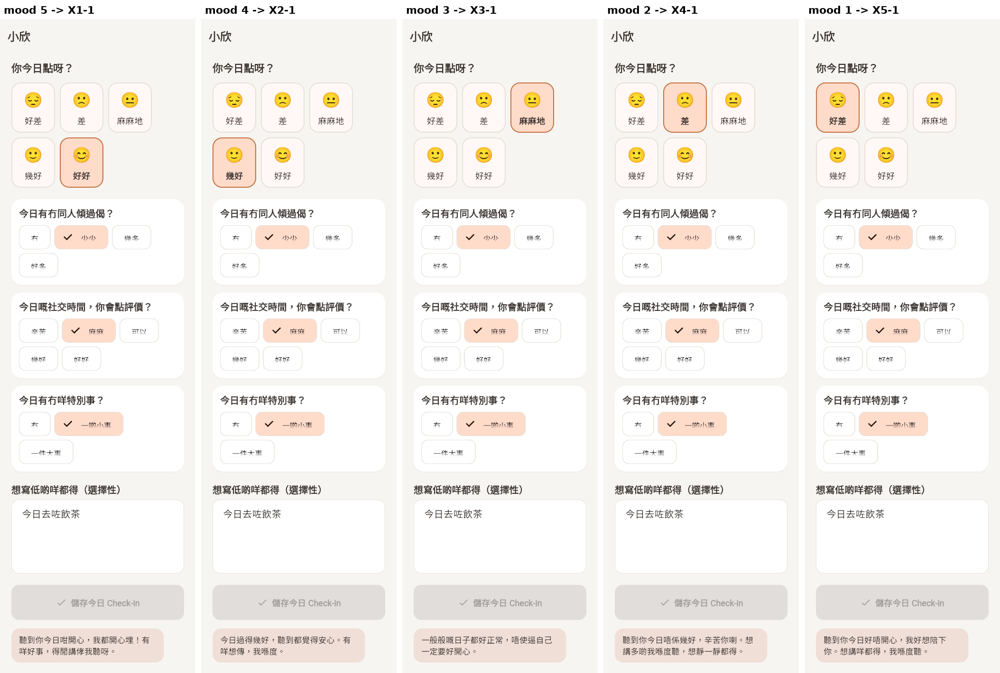
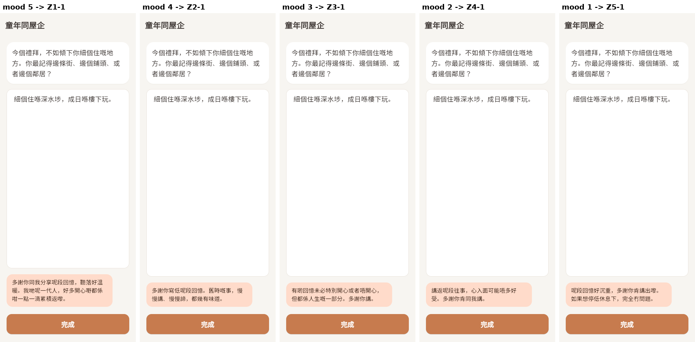
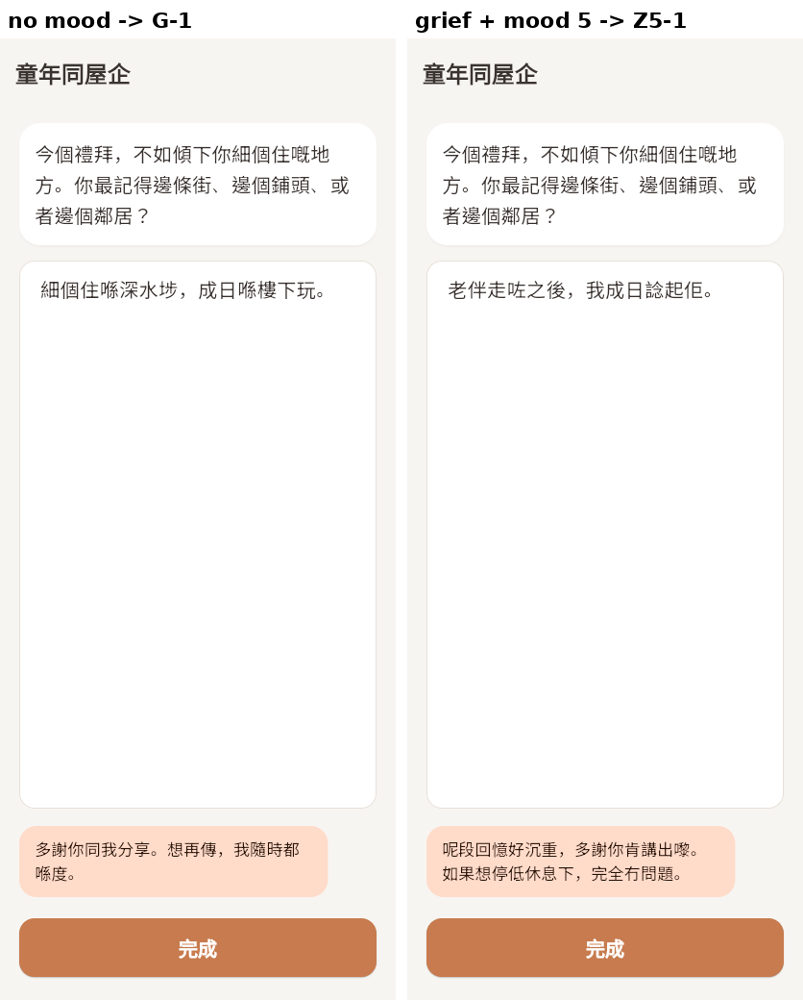

# T33 定稿文字接入（SPEC:C02、C06、C07、C17、C18）

日期：2026-10-10　分支：`feat/final-copy`　决策记录：`docs/decisions/0032-rule-templates-final-structure.md`
依据：`docs/spec/copy/rule-templates.md`、`docs/spec/copy/short-texts.md`；任务单 `docs/dev-tasks/dev-tasks-1010.md` T33。

## 结论

- 规则组模板换成定稿 41 条，结构按定稿改：**陪伴者 × 五档心情**，回忆没选心情用 G-1，回忆里的哀伤内容（`moderate_review`）用 Z5。逐字和定稿一致，有脚本比对。
- **疑似错字的 23 条带“待确认”标记**。只要还有一条，开关打开也不出模板。S2 同样处理。
- 短文字：S1a、S2、S3、S4a 已接入；S5 只写建议（第 3 节），没有写入配置。
- **开关一个都没打开**，默认值都没变。唯一没有开关的是 S3（人生點滴入口一句话），下一个 App 版本参与者就看得到。
- 测试：`tool/ci_flutter_tests.sh` 六套全部通过；`tool/ci_backend_tests.sh` 全部通过。
- 另外发现一个和本任务无关的网页版错误（第 5 节），没改。

## 开关（都没改默认值）

| 开关 | 默认 | 管什么 |
|---|---|---|
| `--dart-define=RULE_TEMPLATE_REPLIES=true` | 关 | 规则组签到、回忆模板回应（`lib/core/feature_flags/feature_flags.dart`）。实际生效看 `RuleReplyPool.enabled`：开关开，且没有占位、没有待确认的字 |
| `--dart-define=RULE_TEMPLATE_REPLIES_ALLOW_PLACEHOLDER=true` | 关 | 只用于测试和截图：允许带占位或待确认的字的模板。**不能用于发布** |
| `app_config/feature_flags.searchOffReplyEnabled` | 关 | S1a |
| `meta/memory_config.forgetAckReply` | 关 | S2（文件带待确认标记时，开了也不用） |
| `app_config/reminders.m7FollowupPushEnabled` | 关 | S4a 推送 |
| （无） | — | S3 |

## 1. 规则组模板

### 1.1 结构（`lib/features/rule_replies/data/rule_reply_pool.dart`）

- 每条：`id`（定稿编号 X1-1 … Z5-4、G-1）、`agent`（`siu_yan` / `ah_jan_ah_bak`；G-1 是 `any`）、`band`、`zh`、`pending`。
- 去掉了 `theme`（阿珍不再分周主题）和 `en`（没有英文定稿，英文界面也显示粤语）。
- 心情档和心情脸逐一对应：

| 心情脸（`MoodFace.rank`） | 界面上的字 | 定稿心情 | `band` | 小欣 | 阿珍/阿伯 |
|---|---|---|---|---|---|
| 5 😊 | 好好 | 好開心 | `very_happy` | X1 | Z1 |
| 4 🙂 | 幾好 | 幾好 | `good` | X2 | Z2 |
| 3 😐 | 麻麻地 | 一般般 | `so_so` | X3 | Z3 |
| 2 🙁 | 差 | 唔係幾好 | `not_good` | X4 | Z4 |
| 1 😔 | 好差 | 好唔開心 | `very_unhappy` | X5 | Z5 |
| 没选 | — | — | `none` | — | G-1 |

映射写在 `RuleReplyPool.moodBands`。小欣签到心情仍必选（`check_in_arm_b.dart`），所以签到不会走到 G-1。

### 1.2 安全内容（`lib/features/rule_replies/rule_reply_safety.dart` `ruleReplyRoute`）

| 命中 | 签到 B | 回忆 B |
|---|---|---|
| 没命中、`low` | 按心情 | 按心情；没选用 G-1 |
| `moderate_review`（哀伤、旧日艰难） | 不给模板（同 T15） | **Z5 四条之一，不看心情**；安全事件和安全流程照旧 |
| `moderate_interrupt` | 不给模板 | 不给模板 |
| `acute` | 不给模板，危机页 | 不给模板，危机页 |

`lib/core/safety/` 没改。回忆页 `reminiscence_arm_b_page.dart` 调用 `ruleReplyRoute(distress, griefTemplates: true)`；签到页仍用 `allowsTemplateReply`。

### 1.3 选法和日志（照 T15）

- 近 3 次不重复：`RuleReplyPicker`，`recentWindow = 3`，没改。每档 4 条，所以 4 次里不会重复；G-1 只有 1 条，每次都是它。
- 日志 `rule_template_reply`：`template_id`（现在是定稿编号）、`pool_version` = `2026-10-10-final`、`theme`（仍记 `check_in` / `w1`–`w4`，只用于分析）、`mood_band`（哀伤时记 `grief`）、`mood`。代码：`rule_reply_service.dart`。

### 1.4 待确认的字

- 照 `rule-templates.md` 开头的表，23 条 `pending: true`，18 条 `false`。
- `RuleReplyPool.hasPlaceholders` 现在 = 有【占位】**或**有 `pending`。所以开关开了也不生效。
- 研究侧确认后：开发窗口先改 `docs/spec/copy/rule-templates.md`（文字和表），再改池子里的文字、去掉 `pending`、改 `version`。`test/final_copy_test.dart` 会检查文字和标记是否跟定稿一致：有标记的条目必须含表里的字，没标记的必须不含。

## 2. 短文字

| 编号 | 改在哪里 | 做法 |
|---|---|---|
| S1a | `lib/features/curious_companion/data/tung_tung_search_intent.dart` `replyS1a` | 换掉占位。英文界面也显示粤语。`version` = `2026-10-10-s1a` |
| S2 | 新文件 `functions/prompts/memory_forget_ack.v2.txt`；`functions/memory.js` `FORGET_ACK_PROMPT` 改指 v2 | v1 不动。v2 让陪伴者一字不改地说 S2。文件第一行是 `【待研究側確認用字】`，`ackUsable` 看到它就不用这个文件。确认后要新建 v3（去掉标记、改字），不改 v2 |
| S3 | `lib/features/reminiscence/presentation/pages/reminiscence_landing.dart` `s3` / `introZh` | 只换数字那一句：「每星期一節，15-25 分鐘。一共 4 個主題，每個禮拜一個。冇標準答案，記得幾多都得。」。`app_config/usage_copy` 有值时仍以配置为准（T20） |
| S4a | `functions/reminders.js` `PUSH_BODY` | 标题仍是「陪住」。不带计划原文 |
| S5 | 没改代码，见第 3 节 | — |

注意 S2 是给 LLM 的指令，陪伴者**多半**会照说，但不能保证逐字。要保证逐字，得改成服务器直接插入固定句子，这是另一种做法，要研究侧决定。

## 3. S5 放在哪（要研究侧确认，确认前不写入 `usage_copy`）

T20 的 7 处（`docs/dev-reports/T20-usage-copy-20261007.md` 第 1a 节）：

| # | 位置 | 原文 | 建议 |
|---|---|---|---|
| 1 | 小欣首次自我介绍 `lib/core/agents/agent_registry.dart` | 你好啊，我係小欣，一個 AI 機械人。我會喺日日陪你傾下偈，聽你今日點。你想點開始都得。 | 保留原文 |
| 2 | 小欣首页一行字 `agent_registry.dart` | 日日陪你傾偈，聽你今日點 | 保留原文 |
| 3 | 小欣介绍页开头 `lib/features/agent_profile/data/agent_profile_content.dart` | 我係小欣，係一個 AI 機械人。……我會喺日日陪你傾下偈，問下你今日點，聽下你嘅心情。…… | 保留原文 |
| 4 | 小欣介绍页「我可以做嘅事」 | 同你做每日嘅心情記錄 | 保留原文 |
| 5 | 阿珍/阿伯介绍页「我可以做嘅事」 | 同你做每星期嘅人生點滴分享（每星期一個主題） | 保留原文 |
| 6 | 人生點滴入口说明 `reminiscence_landing.dart` | 每星期一節，15-25 分鐘。4 個主題、4 個禮拜。冇標準答案，記得幾多都得。 | 保留（本任务已按 S3 改数字句） |
| 7 | 常见问题「我冇填 check-in 會唔會有事？」的回答 `lib/features/settings/presentation/pages/faq_page.dart` | 完全唔會有事。呢度冇分數、冇評分。就算一整個星期冇填，你返嚟嗰陣都係一樣受歡迎。 | **建议放 S5** |

理由：S5 是一整段使用建议，1–6 处都是陪伴者介绍或课程节奏，放进去会很长；第 7 处问的就是“不用会怎样”，S5 最后一句「唔係硬性規定，用多用少都唔會影響…」正好回答。原文「就算一整個星期冇填」和“每周最少五次”放在一起会矛盾（T20 已提过），所以建议用 S5 替换，不是追加。其余 6 处没有讲具体次数，和 S5 不冲突，建议保留。

还有两个前提：
- `app_config/usage_copy` 现在两期共用，S5 只写给 Phase B；Phase A 的 7 天版还没定稿。写入前要先按研究期分开（T21 之后）。
- S5 有待确认的字（傳下偈、瞌覺），确认前不写。

## 4. 测试

| 测试 | 内容 |
|---|---|
| `test/final_copy_test.dart`（新） | 读 `rule-templates.md`：41 条编号一致、逐字一致、陪伴者和心情档对得上；`pending` 和「待确认的字」表一致。读 `short-texts.md`：S1a 逐字一致；S3 逐字一致，并在页面上显示 |
| `functions/test/final_copy_test.js`（新） | S4a 等于推送正文；v2 prompt 含 S2 原文；v1 没被改；带待确认标记时确认句不生效，去掉标记后生效 |
| `test/rule_reply_pool_test.dart` | 每档 4 条、G-1、哀伤 → Z5；五档映射；近 3 次不重复；默认不生效；分档路由（哀伤只在回忆、interrupt 和 acute 不给） |
| `test/rule_reply_pages_test.dart` | 开关开：签到五档、回忆五档各走一次；没选心情 → G-1；回忆哀伤 + 选「好好」→ Z5-1；回忆 interrupt、签到哀伤 → 没有模板；acute → 危机页；全程不调 LLM。开关关：页面和原来一样 |
| `tool/ci_flutter_tests.sh` 第 5 套（只开 `RULE_TEMPLATE_REPLIES`） | 有待确认条目时，开关开了页面也和关时一样 |
| `test/phase_b_flags_test.dart`、`functions/test/reminders_emulator_test.js` | 旧的“仍是占位”“件事點呀？”断言改成定稿 |

结果：`tool/ci_flutter_tests.sh` 六套全过；`tool/ci_backend_tests.sh` 全过（Functions 单元测试、规则、模拟器测试、删除脚本）。`flutter analyze` 没有新问题。`functions/` ESLint：改过的文件没问题；`functions/test/llm_flags_test.js` 原来就有 52 个错误，没动。

## 5. 截图（Flutter web + Chromium，离线，不连 Firebase、不调 LLM）

入口 `T33-final-copy-20261010-screenshots/t33_screens_main.dart`，脚本 `t33_shots.js`。打包加了 `ALLOW_PLACEHOLDER`，因为还有待确认的字。

| 图 | 内容 |
|---|---|
|  | 签到 B，五档心情 → X1-1 … X5-1 |
|  | 回忆 B，五档心情 → Z1-1 … Z5-1 |
|  | 回忆 B：没选心情 → G-1；写「老伴走咗之後…」并选「好好」→ Z5-1 |

**网页版错误（和本任务无关，没改）**：`lib/core/safety/safety_check.dart` `newTurnId` 用 `_rng.nextInt(1 << 32)`。在网页版里 `1 << 32` 是 0，签到 B、回忆 B 一提交就报错。Android 没这个问题（参与者用 Android）。截图时本地临时改成 `nextInt(0x7fffffff)` 打包，打完就还原，没有提交。要修得改 `lib/core/safety/`（两组同时生效），建议另开任务（backlog 第 80 项）。

## 6. 和别的任务的交叉

- T31 也改 `functions/memory.js`；本任务只动了 `FORGET_ACK_PROMPT`、`forgetAck` 和导出。
- T27 接 S6、T25 接 S9/S10、T21 接 S8、T31 接 S7、T24 接 S12：本任务没碰。

## 要带回研究侧的发现

1. **待确认的字**（`rule-templates.md` 开头的表）：23 条模板、S2、S5。确认前，规则组模板和 S2 开关打开也不生效。S5 另有「瞌覺」要确认。
2. **S5 放在哪**：建议用 S5 替换第 7 处（常见问题「冇填 check-in」的回答），其余 6 处保留原文（第 3 节）。写入前 `usage_copy` 要先按研究期分开。
3. **心情脸的字和定稿心情名不一样**：界面写「好差 / 差 / 麻麻地 / 幾好 / 好好」，定稿写「好唔開心 / 唔係幾好 / 一般般 / 幾好 / 好開心」。现在按位置对应（第 1.1 节）。要不要改界面上的字（两组共用，Hybrid 签到也会变）。
4. **回忆 B 心情提示还是【占位】**：「你而家心情點？（可以唔揀）」。定稿规则里叫「講起呢段往事嘅心情」。模板开关打开前要定稿，不然老人会看到【占位】。
5. **签到命中 `moderate_review` 不给模板**：定稿只给了回忆的哀伤规则。签到里写到“好辛苦”“過咗身”现在没有回应，要不要也给（例如 X5）。
6. **`moderate_review` 不只是哀伤**：它包括旧日艰难（「好辛苦」「辛苦到」）；如果 PI 把“绝望”类词设成 `moderate_review`，那些也会走 Z5。
7. **回忆 `moderate_interrupt` 不给模板**（会弹支援面板）。是否接受。
8. **S2 能不能保证逐字**：现在是让陪伴者照说，LLM 多半照说但不能保证。要保证就改成服务器插入固定句子。
9. **没有英文定稿**：模板和 S1a 在英文界面也显示粤语。参与者都用中文界面，影响应该很小。
10. **S3 没有开关**：合并后下一个 App 版本参与者就看到新句子。
11. **打开时间**：模板开关打开后，规则组参与者会在研究中途看到新回应（同 T15）；打开日期和影响的 cohort 要写进 STUDY_CHANGELOG。
