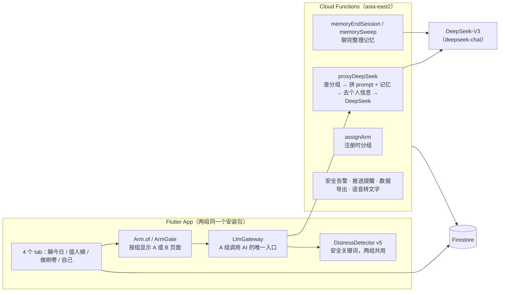

# 陪住 App 技术文档

> 最后核对：2026-10-04，`main` @ 8469581。代码改了，这份跟着改（同一个 PR）。
> 读者：项目负责人、新加入的开发者。先读这份，再按需要读各专题文档。

## 1. 一句话

陪住是给香港长者用的粤语陪伴 App，有三个 AI 陪伴者。Phase B 是两组随机对照：**Hybrid 组**（规则 + LLM，下文也叫 A 组）和**规则组**（只有规则，下文也叫 B 组）。两组装同一个 App，界面一样，差别只在「回应是谁生成的」：A 组由 DeepSeek 生成，B 组用预先写好的粤语模板。

## 2. 系统组成



| 部分 | 技术 | 代码位置 |
|---|---|---|
| App | Flutter **3.35.3**（固定版本，见 `docs/dev/ci-cd.md`） | `lib/` |
| 服务器 | Firebase Cloud Functions v2，Node 24，区域 `asia-east2` | `functions/` |
| 数据库 | Firestore，项目 `loneliness-pilot-dev` | 规则 `firestore.rules` |
| 大模型 | DeepSeek-V3，经 `proxyDeepSeek` 调用，API key 只在服务器上 | `functions/index.js` |
| 语音转文字 | Google Speech（chirp_2，失败退回 long） | `transcribeAudio` |
| iOS 发布 | Codemagic | `codemagic.yaml` |
| 测试和部署 | GitHub Actions | `.github/workflows/` |

## 3. 三个陪伴者和各模块

| 陪伴者 | 角色 | 主要模块 |
|---|---|---|
| 小欣 `siu_yan` | 每日签到、情绪 | M2 签到、M5 反思、M6 社交建议 |
| 阿珍 / 阿伯 `ah_jan_ah_bak` | 回忆、倾偈（老人在 onboarding 选性别版本） | M3 回忆（每周主题）、自由对话 |
| 通通 `tung_tung` | 好奇、闲聊、资讯 | 通通聊天、M8 文章问答 |

Persona 设定在 `functions/prompts/{siu_yan,ah_jan_ah_bak,tung_tung}_v1.txt`。

**两组各模块对照**

| 模块 | Hybrid 组（A） | 规则组（B） |
|---|---|---|
| M2 小欣签到 | LLM 对话 + 记忆 | 心情脸 + 3 道选择题 + 一段文字（`check_in_arm_b.dart`） |
| M3 阿珍/阿伯回忆 | LLM 对话 + 周摘要 | 固定主题开场 + 一个输入框（`reminiscence_arm_b_page.dart`） |
| 阿珍/阿伯自由对话 | LLM | **入口隐藏**（决策 0006） |
| 通通 | LLM 闲聊 + 文章问答 + 网络搜索 | 同一页面，开场题库每天换一条，回应按 10 类话题从模板选（`tung_tung_rule_responder.dart`，决策 0005） |
| M5 反思 | 按上下文生成题目 | 固定题库轮换 |
| M6 社交建议 | 个性化 | 16 条建议池 |
| M7 行动计划 | LLM 辅助 | 模板 |
| M8 文章 | 多一个「問通通呢篇」按钮 | 无该按钮 |
| M9 进度 | 多一张 LLM 周小结卡 | 无该卡 |
| 首页个性化问候、跨陪伴者转介 | LLM 生成 | 不出现 |
| 跨会话记忆 | 有（决策 0001、0007） | 无 |
| 安全检测、问卷、推送 | 相同 | 相同 |

页面按组切换的方式：`ArmGate(armA: …, armB: …)`，或者页面内 `Arm.isA(context)`（`lib/core/arm/arm_scope.dart`）。

## 4. 分组和 cohort

**分组（arm）**：注册时 App 调 Cloud Function `assignArm`（`functions/arm.js`）。服务器在一个事务里：

1. 按 UCLA 基线分（>44 算高）× 年龄（≥70 算高）分到 4 个层（`strataCell` 0–3）；
2. 读 `meta/arm_counter` 里这一层的 A/B 人数，少的那组优先，一样多就抛硬币；
3. 写入 `users/{uid}`：`arm`、`strataCell`、`armAssignedBy: "server"`、`armAssignedAt`、`armAssignmentMode`。

随机开关在 `app_config/arm_assignment.randomise`。不是 `true` 时一律分到 A，`armAssignmentMode` 记 `force_a`。

**防护**：

- `arm` 写入后不能改、不能删（Firestore 规则）；客户端不能写 `armAssignmentMode` / `armAssignedBy` / `armAssignedAt`。
- `proxyDeepSeek`、`referralJudgement`、`webSearch` 每次先查分组，B 组直接拒绝。即使 App 哪里判断错了，B 组也拿不到 LLM。
- 分组还没拿到（`arm` 为空）时 App 显示 B 组界面（决策 0004），下次登录自动重试分组。

**编译开关**：现在 Phase B 界面靠 `--dart-define=PHASE_B=true` 打开，不加就是「所有人显示 A 组」的 Phase A 包。决策 0011 定了要改成 `cohort` 字段并删掉这个开关，**还没做**。

**cohort（已决定，未实现，决策 0011）**：`users/{uid}.cohort` = `pilot`（现有全部账号）/ `phase_a` / `phase_b`，由 `assignArm` 写入。

## 5. 一条消息的旅程（A 组）

1. 老人在聊天页输入（文字或语音）。
2. `LlmGateway` 先用 `DistressDetector` 查输入：
   - **acute（急性）**：不调模型，显示热线，打开紧急支援页；
   - **moderate_interrupt**：照常回复，同时打断显示支援模板；
   - **moderate_review**：照常回复，事后供研究员查看；
   - 以上都写 `safety_events`，服务器 `onSafetyEventCreated` 通知 PI。
3. 调 `proxyDeepSeek`：
   - 查分组（B 组拒绝）；
   - 读 persona prompt 文件，接上 App 传来的上下文（`contextSuffix`）；
   - 记忆 v1 用户：服务器自己读记忆、拼进 prompt（见第 7 节）；
   - `stripPII` 去掉电话、邮箱、身份证等；
   - 调 DeepSeek，计算 5 个「LLM 独有机制」标记（`functions/llm_flags.js`）。
4. 回复再查一次安全词，然后显示。
5. 记录：每轮写 `turns`，每次会话写 `sessions`（`ChatSessionRecorder`）；没有被安全标记的轮次写进记忆缓冲区。
6. 离开页面：会话结束 → 整理记忆 → 满足条件时弹 Brief PR（见第 6 节）。

**B 组**：同样的页面外壳，第 2 步一样；第 3 步换成本地规则选模板，`turns` 里标 `llmStatus: rule_based`。不调 LLM，不写记忆。

## 6. 会话和 Brief PR

| 项目 | 现在的实现 | 位置 |
|---|---|---|
| 会话开始 | 聊天页里**第一条用户消息**发出时（不是打开页面时） | `lib/core/session/chat_session_recorder.dart` |
| 会话结束 | 离开页面（`user_left`）；**10 分钟**没有新消息（`timeout`）；触发 acute（`crisis`）；App 被杀掉的，下次启动补记 `app_killed` | 同上；分钟数在 `PhaseAConfig.sessionIdleTimeoutMin` |
| Brief PR 弹出 | 离开聊天页时，本次会话用户发言 **≥2 轮**且不是 crisis 结束 | `lib/features/brief_pr/data/brief_pr_gate.dart`；轮数在 `PhaseAConfig.briefPRMinTurns` |
| Brief PR 出现的页面 | 签到 A、回忆 A、自由对话 A、通通（**两组都有**） | 各页面的 `BriefPrGate()` |
| 首次 Brief PR | 每个陪伴者第一次弹出时没有「跳过」按钮（anchor） | `isAnchorPromptFor` |

⚠️ **签到 B 和回忆 B 不弹 Brief PR。** 如果 Brief PR 是 Phase B 的结局测量，两组的测量口径现在不一样，见 `docs/dev/backlog.md`。

## 7. 记忆

现在有两套，按用户分：

| | v0（旧） | v1（新） |
|---|---|---|
| 谁用 | pilot 用户 | Phase B 的 A 组（`arm == A` 且 `armAssignmentMode == randomise`），以及 `MEMORY_V1` 测试包里自愿开启的人 |
| 跑在哪 | App | 服务器 |
| 记什么 | 每个陪伴者一段 ≤500 字滚动摘要 | 会话摘要、8 类事实、带日期的待跟进 |
| 老人能看 | 不能 | 「我記得嘅嘢」页面：看、确认敏感条目、删除 |

- v1 的详细实现：`docs/dev/memory-v1.md`
- 接下来要改成什么样：`docs/dev/memory-and-entry-spec.md`
- 研究上为什么这样设计：`docs/research/memory-in-hybrid-arm.md`

**v1 生效需要服务器开关**：Firestore `meta/memory_config` = `{enabled: true, policy: "C", phaseBArmA: true}`。没有这个文档时 v1 不工作；而 App 对 Phase B A 组已经不再做 v0 摘要，所以**这时 A 组两套记忆都没有**。上线时这个文档必须写。

## 8. 数据：Firestore 里有什么

**每个用户 `users/{uid}`**

| 字段 / 子集合 | 内容 | 写入者 |
|---|---|---|
| 用户文档本身 | 资料、年龄段、UCLA 基线、`arm`、`strataCell`、分组时间和方式、同意设定、`memory_enabled` | App；分组字段由服务器写 |
| `sessions` / `turns` | 每次会话、每一轮对话（含模型、`promptVersion`、延迟、安全等级） | App |
| `events` | 行为事件（打开页面、推送、按钮等） | App |
| `brief_pr`、`weekly_pr`、`daily_mood`、`djg_es`、`pgic`、`ppr_responses`、`loneliness_probes`、`check_in_responses` | 问卷和量表 | App |
| `agent_contexts/{agentId}` | v0 记忆：对话缓冲区 + 滚动摘要 | App |
| `memory/{moduleId}/entries` | 各模块的会话摘要（回忆、反思、社交建议、行动计划） | App |
| `shared_context` | 三个陪伴者共用：最近情绪、安全标记、行动计划 | App |
| `agent_greetings` | 每天预生成的个性化开场白（只 A 组） | App |
| `mem_facts` / `mem_summaries` / `mem_followups` | v1 记忆 | 服务器；App 只能读、删、确认 |
| `mem_injections` / `mem_extractions` | v1 注入日志、抽取记录 | 服务器；App 不能读 |
| `action_plans`、`thought_records`、`reminders`、`fcm_tokens` 等 | 各功能自己的数据 | App |

**全局**

| 位置 | 内容 |
|---|---|
| `app_config/arm_assignment` | `{randomise: bool}`：是否随机分组 |
| `meta/arm_counter` | 4 个层各自的 A/B 人数 |
| `meta/memory_config` | 记忆总开关、共享策略、Phase B A 组强制开 |
| `safety_events`、`pi_alerts` | 安全事件、给 PI 的告警队列 |
| `export_blind_keys` | 盲法导出时组别 → Group_X / Group_Y 的对照 |

## 9. Cloud Functions

| 函数 | 触发 | 做什么 |
|---|---|---|
| `proxyDeepSeek` | App 调用 | 所有 LLM 对话；拼 prompt 和记忆 |
| `assignArm` | App 调用（注册、登录补分） | 分组 |
| `memoryEndSession` | App 调用（离开聊天页） | v1：整理这次对话的记忆 |
| `memorySweep` | 每 15 分钟 | v1：补整理 30 分钟没有新消息的对话 |
| `referralJudgement` | App 调用 | 跨陪伴者转介的第二层判断（只 A 组） |
| `webSearch` | App 调用 | 通通的网络搜索（只 A 组） |
| `transcribeAudio` | App 调用 | 语音转文字（两组） |
| `safetyAcknowledgement` | App 调用 | 按陪伴者返回安全回应模板 |
| `onSafetyEventCreated` | 新安全事件 | 通知 PI |
| `onThoughtExerciseCreated` | 新思维练习 | 写入研究员审计队列 `te_audit_queue` |
| `weeklyLonelinessProbe` | 每周日 9:00（香港时间，下同） | 生成周度孤独感问卷队列（App 端默认不显示） |
| `blindedDataExport` | 每周日 2:00 | 盲法数据导出 |
| `dailyMoodReminder` | 周一至六 19:00 | 每日情绪提醒 |
| `weeklySurveyReminder` | 周日 20:00 | 周问卷提醒 |
| `week2Push` | 每天 10:00 | 第二周推送 |
| `sendTestPush` | App 调用 | 测试推送（测试人员） |

**部署顺序**（新版本上线时）：

1. 部署 Cloud Functions 和 Firestore 规则（Actions →「Deploy Firebase」）；
2. 写 Firestore 配置：`app_config/arm_assignment`、`meta/memory_config`；打开随机前先清零 `meta/arm_counter`；
3. 发布 App。

顺序反了，新用户注册时分不到组，或者分组方式被记错，而分组写入后不能改。

## 10. 安全

- **词库**：`lib/core/safety/distress_detector.dart`，当前版本 v5-2026-09，说明在 `docs/safety/distress_detector_lexicon_v5-2026-09.md`。两组共用。临床取舍的 PI 签核**搁置**，先沿用 v5（决策 0012）。
- **四级**：none / moderate_review / moderate_interrupt / acute。
- **安全回应模板和热线**：`functions/prompts/safety_acknowledgements.json`、`crisis_resources.json`，App 和服务器读同一份。
- **被安全标记的轮次不进入记忆**（决策 0013）。记忆 v1 在服务器上再查一次自杀、自残等词。
- **两组都通知 PI**（决策 0014）。

## 11. 版本追溯

| 已有 | 位置 |
|---|---|
| `appVersion`、`buildNumber` | `lib/core/version/build_info.g.dart`（由 `tool/export_spec_inputs.py` 生成） |
| prompt、安全文件、词库的 SHA-256 | 同上，`kArtefactHashes`；`test/phase_a_version_pin_test.dart` 检查是否过期 |
| `promptVersion`（如 `siu_yan_v1@2026-06`） | 服务器从 prompt 文件第一行读，写进每条 `turns` |
| `model` | DeepSeek 返回的 `model` 字段 |

还没有：`buildSha`（git commit）、`memoryVersion`、敏感词表版本。见 `docs/dev/memory-and-entry-spec.md` 3.6。

## 12. 编译开关和测试

| 开关 | 作用 |
|---|---|
| `--dart-define=PHASE_B=true` | 按分组显示界面（不加 = 全员显示 A 组）。计划删除（决策 0011） |
| `--dart-define=FORCE_ARM=A` / `B` | 本地调试强制组别，**不能用于发布** |
| `--dart-define=MEMORY_V1=true` | 测试人员可在设置里自愿开启记忆 v1 |
| `--dart-define=TESTER_PIN=…` | 解锁测试工具（日程模拟器、测试推送） |
| `--dart-define=WEEKLY_PROBE=true` | 显示周度孤独感问卷 |

本地跑和 CI 一样的测试：

```bash
tool/ci_flutter_tests.sh     # Flutter：默认、Phase B 分组、B 组页面、记忆 v1 四套
tool/ci_backend_tests.sh     # Cloud Functions + Firestore 规则（需要 Firebase 模拟器）
```

注意：Flutter 工具会改 `analysis_options.yaml` 和 `pubspec.lock`，提交前 `git checkout` 这两个文件。

## 13. 其他文档

| 文档 | 内容 |
|---|---|
| `docs/README.md` | 文档怎么组织、怎么更新 |
| `docs/dev/backlog.md` | 待办、待决定、已知问题 |
| `docs/history.md` | 开发记录：做过什么、讨论过什么 |
| `docs/decisions/` | 每个设计决定一份 |
| `docs/dev/ci-cd.md` | CI、打 APK、部署 |
| `docs/research/arm_assignment_scheme_v1.md` | 分组方案的方法学讨论 |
| `docs/safety/` | 安全词库各版本和性能 |
| `docs/prompts/agent_system_prompts_2026-09.md` | 三个陪伴者的 prompt 全文 |
| `docs/privacy/strip_pii.md` | 个人信息清洗规则 |
| `docs/release/` | Phase A 基线版本的交接和评审（pilot 期） |
| 根目录 `ARCHITECTURE_NOTES.md` 等 | 早期开发笔记，部分已过时，以本文档为准 |
