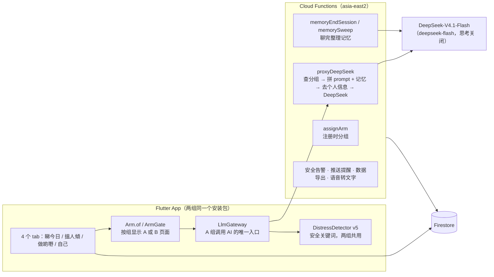

# 陪住 App 技术文档

> 最后核对：2026-10-04，`main` @ fa62c81 + 决策 0015 的改动；2026-10-07 补 T7 安全检测（决策 0018）、决策 0019（搜一搜、语音开关）、同意与删除（决策 0020）；T17 Phase A 的 ADA 和第 7 日开放题（决策 0026）。代码改了，这份跟着改（同一个 PR）。
> 读者：项目负责人、新加入的开发者。先读这份，再按需要读各专题文档。

## 1. 一句话

陪住是给香港长者用的粤语陪伴 App，有三个 AI 陪伴者。Phase B 是两组随机对照：**Hybrid 组**（规则 + LLM，下文也叫 A 组）和**规则组**（只有规则，下文也叫 B 组）。两组装同一个 App，界面一样，差别只在「回应是谁生成的」：A 组由 DeepSeek 生成，B 组用预先写好的粤语模板。

## 2. 系统组成



| 部分 | 技术 | 代码位置 |
|---|---|---|
| App | Flutter **3.35.3**（固定版本，见 `docs/dev/ci-cd.md`） | `lib/` |
| 服务器 | Firebase Cloud Functions v2，Node 24，区域 `asia-east2` | `functions/` |
| 数据库 | Firestore，项目 `loneliness-pilot-dev` | 规则 `firestore.rules` |
| 大模型 | DeepSeek-V4.1-Flash（请求 `deepseek-flash`，`thinking` 关闭，决策 0017），经 `proxyDeepSeek` 调用，API key 只在服务器上 | `functions/index.js` 的 `DEEPSEEK_MODEL` |
| 语音转文字 | App 用手机系统识别（`speech_to_text`）；服务器另有 Google Speech（chirp_2，失败退回 long），App 没有调用。**Phase B 默认关**（第 12 节） | `lib/core/voice/voice_input_button.dart`、`transcribeAudio` |
| iOS 发布 | Codemagic | `codemagic.yaml` |
| 测试和部署 | GitHub Actions | `.github/workflows/` |

## 3. 三个陪伴者和各模块

| 陪伴者 | 角色 | 主要模块 |
|---|---|---|
| 小欣 `siu_yan` | 每日签到、情绪 | M2 签到、M5 反思、M6 社交建议 |
| 阿珍 / 阿伯 `ah_jan_ah_bak` | 回忆、倾偈（老人在 onboarding 选性别版本） | M3 回忆（每周主题）、自由对话 |
| 通通 `tung_tung` | 好奇、闲聊、资讯 | 通通聊天、M8 文章问答 |

Persona 设定在 `functions/prompts/`：小欣、阿珍/阿伯用 `*_v1.txt`；通通用 `tung_tung.v2.txt`（App 仍发 `tung_tung_v1`，服务器按 `functions/index.js` 的 `PROMPT_FILES` 换成 v2，决策 0019）。旧文件保留不改。

**两组各模块对照**

| 模块 | Hybrid 组（A） | 规则组（B） |
|---|---|---|
| M2 小欣签到 | LLM 对话 + 记忆 | 心情脸 + 3 道选择题 + 一段文字（`check_in_arm_b.dart`）；开关 `RULE_TEMPLATE_REPLIES` 开时，提交后按心情给一条模板回应（决策 0023，默认关） |
| M3 阿珍/阿伯回忆 | LLM 对话 + 周摘要 | 固定主题开场 + 一个输入框（`reminiscence_arm_b_page.dart`）；开关开时多一个选填心情脸，提交后按心情 × 每周主题给一条模板回应（决策 0023，默认关） |
| 阿珍/阿伯自由对话 | LLM | **入口隐藏**（决策 0006） |
| 通通 | LLM 闲聊 + 文章问答（网络搜索默认关，决策 0019） | 同一页面，开场题库每天换一条，回应按 10 类话题从模板选（`tung_tung_rule_responder.dart`，决策 0005） |
| M5 反思 | 按上下文生成题目 | 固定题库轮换 |
| M6 社交建议 | 个性化 | 16 条建议池 |
| M7 行动计划 | LLM 辅助 | 模板 |
| M8 文章 | 多一个「問通通呢篇」按钮 | 无该按钮 |
| M9 进度 | 多一张 LLM 周小结卡 | 无该卡 |
| 首页个性化问候、跨陪伴者转介 | LLM 生成 | 不出现 |
| 跨会话记忆 | 有（决策 0001、0007） | 无 |
| 安全检测、问卷、推送 | 相同 | 相同 |

页面按组切换的方式：`ArmGate(armA: …, armB: …)`，或者页面内 `Arm.isA(context)`（`lib/core/arm/arm_scope.dart`）。

## 4. 分组和 cohort

**分组（arm）**：注册时 App 调 Cloud Function `assignArm`（`functions/arm.js`）。服务器在一个事务里：

1. 按 UCLA 基线分（>44 算高）× 年龄（≥70 算高）分到 4 个层（`strataCell` 0–3）；
2. 读 `meta/arm_counter` 里这一层的 A/B 人数，少的那组优先，一样多就抛硬币；
3. 写入 `users/{uid}`：`arm`、`strataCell`、`armAssignedBy: "server"`、`armAssignedAt`、`armAssignmentMode`。

随机开关在 `app_config/arm_assignment.randomise`。不是 `true` 时一律分到 A，`armAssignmentMode` 记 `force_a`。

**防护**：

- 分组字段（`arm`、`strataCell`、`armAssignmentMode`、`armAssignedBy`、`armAssignedAt`）只有服务器能写：客户端建档时不能带，之后不能改、不能删；客户端也不能删自己的用户文档，免得删档重建换组（Firestore 规则，决策 0022）。
- `proxyDeepSeek`、`referralJudgement`、`webSearch` 每次先查分组，B 组直接拒绝。即使 App 哪里判断错了，B 组也拿不到 LLM。
- 分组还没拿到（`arm` 为空）时 App 显示 B 组界面（决策 0004），下次登录自动重试分组。

**编译开关**：现在 Phase B 界面靠 `--dart-define=PHASE_B=true` 打开，不加就是「所有人显示 A 组」的 Phase A 包。决策 0011 定了要改成 `cohort` 字段并删掉这个开关，**还没做**。

**cohort（已决定，未实现，决策 0011）**：`users/{uid}.cohort` = `pilot`（现有全部账号）/ `phase_a` / `phase_b`，由 `assignArm` 写入。

## 5. 一条消息的旅程（A 组）

1. 老人在聊天页输入（文字；语音默认关，见第 12 节）。
2. `LlmGateway` 先用统一入口 `SafetyService`（`lib/core/safety/safety_check.dart`，内部是 `DistressDetector`）查输入：
   - **acute（急性）**：不调模型，显示热线，打开紧急支援页；
   - **moderate_interrupt**：照常回复，同时打断显示支援模板；
   - **moderate_review**：照常回复，事后供研究员查看；
   - 以上都写 `safety_events`（`source`、`inputPoint`、`turnId`），服务器 `onSafetyEventCreated` 去重、acute 通知 PI。
3. 调 `proxyDeepSeek`：
   - 查分组（B 组拒绝）；
   - 读 persona prompt 文件，接上 App 传来的上下文（`contextSuffix`）；
   - 记忆 v1 用户：服务器自己读记忆、拼进 prompt（见第 7 节）；
   - prompt 末尾加「不写电话号码」规则 `hotline_rule.v1`（开关 `meta/safety_config.hotlinePromptRule`）；
   - `stripPII` 去掉电话、邮箱、身份证等；
   - 调 DeepSeek，计算 5 个「LLM 独有机制」标记（`functions/llm_flags.js`）；
   - 在 `llm_calls` 记一条：返回的 `model`、token 数、延迟（见第 11 节）；
   - 回复里的电话号码全部换成「【緊急熱線】」，每次替换记一条 `hotline_filter_log`（开关 `hotlineOutputFilter`）。
4. 回复再查一次安全词（只在级别高于输入时写事件，一轮只算一条），App 再过一遍号码过滤，然后显示。「【緊急熱線】」显示成链接，点开是危机页。
5. 记录：每轮写 `turns`，每次会话写 `sessions`（`ChatSessionRecorder`）；没有被安全标记的轮次写进记忆缓冲区。
6. 离开页面：会话结束 → 整理记忆 → 满足条件时弹 Brief PR（见第 6 节）。

**B 组**：同样的页面外壳，第 2 步一样（同一个 `SafetyService`）；第 3 步换成本地规则选模板，`turns` 里标 `llmStatus: rule_based`。不调 LLM，不写记忆。

**B 组签到、回忆的模板回应**（决策 0023，开关 `RULE_TEMPLATE_REPLIES`，默认关）：提交时先做安全检测；命中 moderate 或 acute 不给模板，走原来的安全流程；没命中就从 `lib/features/rule_replies/data/rule_reply_pool.dart` 按「陪伴者 × 主题 × 心情档」选一条，近 3 次不重复（记录在 `users/{uid}/rule_reply_history/{agentId}`），写进 `turns` 的回复，并记分析事件 `rule_template_reply`。模板现在都是【占位】文字；有占位文字时，即使开了开关也不生效，除非另加 `RULE_TEMPLATE_REPLIES_ALLOW_PLACEHOLDER=true`（只用于截图和测试）。

## 6. 会话和 Brief PR

| 项目 | 现在的实现 | 位置 |
|---|---|---|
| 会话开始 | 聊天页里**第一条用户消息**发出时（不是打开页面时） | `lib/core/session/chat_session_recorder.dart` |
| 会话结束 | 离开页面（`user_left`）；**10 分钟**没有新消息（`timeout`）；触发 acute（`crisis`）；App 被杀掉的，下次启动补记 `app_killed` | 同上；分钟数在 `PhaseAConfig.sessionIdleTimeoutMin` |
| Brief PR 弹出（聊天页） | 离开聊天页时，本次会话用户发言 **≥2 轮**且不是 crisis 结束 | `lib/features/brief_pr/data/brief_pr_gate.dart`；轮数在 `PhaseAConfig.briefPRMinTurns` |
| Brief PR 弹出（签到 B、回忆 B） | 每次提交算一次会话，提交后弹出，acute 结束的不弹（决策 0015） | `lib/features/brief_pr/data/rule_submission_flow.dart` |
| Brief PR 出现的页面 | 两组的签到、回忆、通通；A 组的自由对话 | 各页面 |
| 首次 Brief PR | 每个陪伴者第一次弹出时没有「跳过」按钮（anchor） | `isAnchorPromptFor` |

签到 B 和回忆 B 也写 `sessions` 和 `turns`（`llmStatus: rule_based`），`moduleId` 和 A 组相同，所以两组的使用量可以直接比较。

### 6.1 Phase A 的 ADA 和第 7 日开放题（决策 0026，默认关）

- **只在 Phase A 构建**：`PHASE_B=true` 的包里永远不出现（`lib/features/ada/data/ada_gate.dart`）。Phase A 包里也要研究侧在 `app_config/phaseA_schedule` 打开才出现。
- **ADA**（`lib/features/ada/presentation/ada_page.dart`）：一屏一项。A 使用频率一屏；B 四个特质各一屏；C 五个情境各一屏（只有全版）；D 长文字一屏。可返回，每换一屏保存一次，默认可跳过（记 `"skipped"`）。阿珍/阿伯按资料里的 `ahJanAhBakVariant` 显示。
- **时间点**：`adaTimepoints` 列出每次施测的编号、短版/全版、入组第几天到第几天、回忆窗口文字。默认（占位）：`visit1` 第 1 天短版；`day7` 第 7–9 天全版。首页横幅在窗口内、还没提交时出现。
- **第 7 日开放题**（`day7_open_page.dart`）：3 题各一屏，和 ADA 的 D 用同一个长文字组件（`lib/core/survey/long_text_answer.dart`）。麦克风只在 `voiceInputEnabled` 开时出现。
- **旧的“陪伴者区分评估”**（`agent_diff`，第 14、28 天）：Phase B 包默认不显示（开关 `LEGACY_AGENT_DIFF_PHASE_B`）；Phase A 包在 `adaEnabled` 打开后不显示，关着时和以前一样。旧数据不动。

## 7. 记忆

现在有两套，按用户分：

| | v0（旧） | v1（新） |
|---|---|---|
| 谁用 | pilot 用户 | Phase B 的 A 组（`arm == A` 且 `armAssignmentMode == randomise`），以及 `MEMORY_V1` 测试包里自愿开启的人 |
| 跑在哪 | App | 服务器 |
| 记什么 | 每个陪伴者一段 ≤500 字滚动摘要 | 会话摘要、8 类事实、带日期的待跟进 |
| 老人能看 | 不能 | 「我記得嘅嘢」页面：看、确认敏感条目、删除 |

- v1 的详细实现：`docs/dev/memory-v1.md`
- 接下来要改成什么样：`docs/dev/memory-and-entry-spec.md`
- 研究上为什么这样设计：`docs/research/memory-in-hybrid-arm.md`

**共享同意（决策 0020）**：`app_config/phase_a.enforceSharedContextConsent` 默认开（服务器上没写 `false` 就算开）。`users/{uid}.consent.sharedContextUse` 不是 `true` 的人，陪伴者之间不共享：v1 共享策略按 B（`functions/memory.js` `effectivePolicy`，注入和抽取都是）；v0 里小欣不引用阿珍/阿伯的回忆摘要，转介不存原话（`lib/core/privacy/shared_context_consent.dart`）。新账号在同意页写 `true`；之后只有 `tool/set_shared_context_consent.js` 改它（`--all` 迁移现有账号，`--uid=X --off` 按人关闭）。App 保存资料时不写这个字段（`UserProfile.toMap` 默认不带），防止旧值盖掉后台的修改。**上线顺序**：先在正式项目跑 `--all --confirm --production`，再部署。

**保留对话**：设置页「保留對話紀錄」开关（两组都有，默认开）同时改全局和三个陪伴者各自的开关（`lib/core/privacy/transcript_retention.dart`）。

**记忆安全、「唔好記住」、删除（T10，决策 0024）**：服务器整理记忆前，用 App 同一份安全词库（`functions/safety_lexicon.json`，从 `lib/core/safety/distress_detector.dart` 生成，`test/safety_lexicon_export_test.dart` 保证一致）查老人原话，命中的轮次不进任何一层，那次会话不写摘要；摘要不写敏感内容；老人说「唔好記住」等（`functions/memory_forget.js`），整段不记并删除相关旧条目；页面删一条，触发器连带删摘要和同样措辞的条目；`tool/delete_memory.js` 写 `memoryWithdrawnAt` 后不再记录（Phase B A 组也一样）。抽取 prompt 改为文件 `functions/prompts/memory_extraction.v2.txt`（v1 保留）。开关都在 `meta/memory_config`，修复默认开，陪伴者确认句 `forgetAckReply` 默认关。改了 App 词库要重新生成 JSON（`UPDATE_SAFETY_LEXICON=1 flutter test test/safety_lexicon_export_test.dart`）。

**v1 生效需要服务器开关**：Firestore `meta/memory_config` = `{enabled: true, policy: "C", phaseBArmA: true}`。没有这个文档时 v1 不工作；而 App 对 Phase B A 组已经不再做 v0 摘要，所以**这时 A 组两套记忆都没有**。上线时这个文档必须写。

## 8. 数据：Firestore 里有什么

**每个用户 `users/{uid}`**

| 字段 / 子集合 | 内容 | 写入者 |
|---|---|---|
| 用户文档本身 | 资料、年龄段、UCLA 基线、`arm`、`strataCell`、分组时间和方式、同意设定、`memory_enabled` | App；分组字段由服务器写 |
| `sessions` / `turns` | 每次会话、每一轮对话（含模型、`promptVersion`、延迟、安全等级） | App |
| `events` | 行为事件（打开页面、推送、按钮等） | App |
| `brief_pr`、`weekly_pr`、`daily_mood`、`djg_es`、`pgic`、`ppr_responses`、`loneliness_probes`、`check_in_responses` | 问卷和量表 | App |
| `djg_responses/W2` | Phase B 第 2 周 DJG（6 题，决策 0027）：原始答案（q1–q6 → yes / mostly / no / skipped）、状态、开始和提交时间；服务器补 `scores`（情感、社交、总分，跳题的分量表为空）、`outsideWindow`、窗口日期、`pushSentAt`、`reminderSentAt`、缺失标记。开关打开后取代 Phase B 的 `djg_es`（旧集合保留） | App 写答案；分数等由服务器写，App 不能改；提交或缺失后 App 不能再改 |
| `ada_responses/{时间点}`、`day7_open_responses/day7` | Phase A 的 ADA 和第 7 日开放题（第 6.1 节）。只有本人能读写；`status` 变成 `submitted` 后不能再改；客户端不能删；不进盲法导出 | App |
| `agent_contexts/{agentId}` | v0 记忆：对话缓冲区 + 滚动摘要 | App |
| `memory/{moduleId}/entries` | 各模块的会话摘要（回忆、反思、社交建议、行动计划） | App |
| `shared_context` | 三个陪伴者共用：最近情绪、安全标记、行动计划 | App |
| `agent_greetings` | 每天预生成的个性化开场白（只 A 组） | App |
| `mem_facts` / `mem_summaries` / `mem_followups` | v1 记忆 | 服务器；App 只能读、删、确认 |
| `mem_injections` / `mem_extractions` | v1 注入日志、抽取记录 | 服务器；App 不能读 |
| `action_plans`、`thought_records`、`reminders`、`fcm_tokens` 等 | 各功能自己的数据。`reminders` 由 App 写入，服务器 `dispatchReminders` 发送后写回 `delivered`、`dispatchStatus` 等 | App；发送状态由服务器写 |

**全局**

App 启动时同时读 `app_config/phase_a`、`app_config/feature_flags`、`app_config/usage_copy`，再加 Phase B 包的 `app_config/phase_b` 或 Phase A 包的 `app_config/phaseA_schedule`。每份最多等 3 秒，读不到就用默认值（`lib/main.dart`）。

| 位置 | 内容 |
|---|---|
| `app_config/arm_assignment` | `{randomise: bool}`：是否随机分组 |
| `app_config/reminders` | `{m7FollowupPushEnabled: bool}`：行动计划提醒发不发，默认关（决策 0022） |
| `app_config/feature_flags` | 搜一搜、语音、通通固定回应三个开关（第 12 节）。没有这份文档 = 全关 |
| `app_config/usage_copy` | 提到使用频率的 7 处文字（决策 0028，键名见 `lib/core/config/usage_copy.dart`）。没有文档、字段为空或带【占位】= 显示原文；两组相同；客户端只读 |
| `app_config/phase_b` | **只属于 Phase B** 的参数（`PhaseBConfig`，服务器 `functions/djg_w2.js` 也读）：`djgW2InAppEnabled`（默认关）、`djgW2DayOffset`（14）、`djgW2WindowDays`（7）、`djgW2PushHour`（10）、`djgW2ReminderHours`（24）。不建 = 关 |
| `app_config/phaseA_schedule` | **只属于 Phase A**：`adaEnabled`、`adaAllowSkip`、`adaTimepoints`、`day7OpenEndedEnabled`、`day7OpenEndedDayFrom`、`day7OpenEndedDayTo`、`day7OpenEndedAllowSkip`（第 6.1 节）。没有这份文档 = 都关。Phase B 包不读 |
| `app_config/phase_a` | App 运行参数（`PhaseAConfig`）的远端覆盖；含同意相关的 `transcriptRetentionDefault`（默认 true）、`sharedContextUseDefault`（默认 true）、`enforceSharedContextConsent`（默认 true，服务器也读）。不建就用默认值 |
| `meta/arm_counter` | 4 个层各自的 A/B 人数。只有非盲角色能读 |
| `meta/memory_config` | 记忆总开关、共享策略、Phase B A 组强制开 |
| `safety_events`、`pi_alerts` | 安全事件、给 PI 的告警队列。事件字段：`source`（user_input / ai_output_scan / form）、`inputPoint`、`turnId`、级别、命中词、文字的哈希；服务器补 `dedup_key`、`isDuplicate`、`duplicateOf`、`escalatedBy`。分析只数 `isDuplicate == false`（决策 0018） |
| `hotline_filter_log` | Hybrid 组 AI 回复里被替换的电话号码：时间、uid、模块、个数、种类、是否在批准清单里。不存原文和号码。只有服务器写 |
| `meta/safety_config` | 热线规则和热线过滤的开关（`hotlinePromptRule`、`hotlineOutputFilter`），没有这个文档 = 都开。T8 分类器：`classifierEnabled`（默认关）、`classifierUrl`、`classifierTimeoutMs`、`classifierMaxChars` |
| `safety_classifier_calls` | 安全分类器的调用记录（两组）：时间、uid、写入方（server / app）、结果状态、级别、分数、延迟、模型版本、输入点、`turn_id`、文字长度。不存原文，不存组别。服务器每次中转写一条；App 只补写请求没回来的（超时、离线）。客户端不能读 |
| `llm_calls` | 每次调用 DeepSeek 一条：时间、调用类型、agent、uid、请求和返回的模型名、`system_fingerprint`、token 数（含思考 token）、HTTP 状态码、延迟、是否出错。不存原文。只有服务器写，App 不能读写（决策 0016） |
| `export_blind_keys` | 盲法导出时组别 → Group_X / Group_Y 的对照。新版用固定的 `stable_v2`，不再每周换 |
| `research_id_map/{uid}`、`research_ids/{researchId}` | 研究编号对照表（决策 0021）。只有服务器写，只有非盲角色（`role: pi`）能读 |
| `meta/blinding_config` | 盲法开关：`enabled`、`includeBriefPr`、`includeUsageSummary`，都默认 false。客户端不能读写 |

**删除**：`tool/delete_memory.js` 只删记忆（保留研究数据）；`tool/delete_participant.js` 删整个参与者（Auth 账号、`users/{uid}` 整棵树（含 `djg_es`、`djg_responses`）、顶层集合里按 `uid` 找到的记录、Storage `users/{uid}/`），默认试运行，`--confirm` 才删，删完复查并写存证（只有数量）。周度导出 `exports/` 默认只数不改，`--rewrite-exports` 才重写。详见 T11 报告。

## 9. Cloud Functions

| 函数 | 触发 | 做什么 |
|---|---|---|
| `proxyDeepSeek` | App 调用 | 所有 LLM 对话；拼 prompt 和记忆 |
| `assignArm` | App 调用（注册、登录补分） | 分组；盲法开关开时同时生成研究编号 |
| `memoryEndSession` | App 调用（离开聊天页） | v1：整理这次对话的记忆 |
| `memorySweep` | 每 15 分钟 | v1：补整理 30 分钟没有新消息的对话 |
| `memoryFactDeleted`、`memoryFollowupDeleted` | 删除一条记忆事实或跟进时 | v1：连带删除来源会话的摘要和同样措辞的条目（T10） |
| `referralJudgement` | App 调用 | 跨陪伴者转介的第二层判断（只 A 组） |
| `webSearch` | App 调用 | 通通的网络搜索（只 A 组）。`webSearchEnabled` 不是 `true` 时直接拒绝 |
| `transcribeAudio` | App 调用（目前 App 没有调用） | 语音转文字（两组）。`voiceInputEnabled` 不是 `true` 时直接拒绝 |
| `safetyAcknowledgement` | App 调用 | 按陪伴者返回安全回应模板 |
| `classifySafety` | App 调用（两组） | T8：把一句话转给安全分类器，只返回级别和分数，记 `safety_classifier_calls`。`meta/safety_config.classifierEnabled` 关着时直接返回 disabled。不调用 DeepSeek，不经过 `assertLlmAllowed`（决策 0025） |
| `onSafetyEventCreated` | 新安全事件 | 通知 PI |
| `onThoughtExerciseCreated` | 新思维练习 | 写入研究员审计队列 `te_audit_queue` |
| `weeklyLonelinessProbe` | 每周日 9:00（香港时间，下同） | 生成周度孤独感问卷队列（App 端默认不显示） |
| `blindedDataExport` | 每周日 2:00 | 盲法数据导出。`meta/blinding_config.enabled` 开：新版（`functions/blinding.js`，研究编号、结局量表白名单，含 W2 DJG `djg_responses`），写到 `exports_v2/{日期}/`，可用 `tool/check_blinded_export.js` 检查；关：旧版 `exports/{日期}/` |
| `dailyMoodReminder` | 周一至六 19:00 | 每日情绪提醒 |
| `weeklySurveyReminder` | 周日 20:00 | 周问卷提醒 |
| `week2Push` | 每天 10:00 | 第二周推送（Phase A 的 DJG + 陪伴者比较）。`djgW2InAppEnabled` 开时跳过 Phase B 参与者，由 `djgW2Dispatch` 推 |
| `djgW2Dispatch` | 每天 08:00–21:00，每小时 | Phase B 第 2 周 DJG（决策 0027）：W0 起第 14 天 10:00 推送一次、24 小时未交提醒一次、窗口（第 14–20 天）过后记缺失。只处理 Phase B 参与者，两组相同。开关 `app_config/phase_b.djgW2InAppEnabled` 默认关；推送文字带【占位】时不发 |
| `onDjgResponseWritten` | `djg_responses` 文档写入 | 提交后由服务器算分（情感 0–3、社交 0–3、总分；跳题记缺失）并标 `outsideWindow` |
| `dispatchReminders` | 每天 08:00–21:45，每 15 分钟 | 发送到时间的行动计划提醒（两组相同，开关 `app_config/reminders.m7FollowupPushEnabled` 默认关；超时 12 小时不补发；失败最多重试 3 次；见 `functions/reminders.js`、决策 0022） |
| `sendTestPush` | App 调用 | 测试推送（测试人员） |

**部署顺序**（新版本上线时）：

1. 部署 Cloud Functions 和 Firestore 规则（Actions →「Deploy Firebase」）；
2. 写 Firestore 配置：`app_config/arm_assignment`、`meta/memory_config`；打开随机前先清零 `meta/arm_counter`。可用 `tool/prelaunch_config.js`（默认只对模拟器执行），完整清单见 `docs/release/prelaunch-checklist.md`；
3. 发布 App。

顺序反了，新用户注册时分不到组，或者分组方式被记错，而分组写入后不能改。

## 10. 安全

- **词库**：`lib/core/safety/distress_detector.dart`，当前版本 v5-2026-09，说明在 `docs/safety/distress_detector_lexicon_v5-2026-09.md`。两组共用。临床取舍的 PI 签核**搁置**，先沿用 v5（决策 0012）。
- **四级**：none / moderate_review / moderate_interrupt / acute。
- **安全回应模板和热线**：`functions/prompts/safety_acknowledgements.json`、`crisis_resources.json`，App 和服务器读同一份。
- **被安全标记的轮次不进入记忆**（决策 0013）。记忆 v1 在服务器上再查一次自杀、自残等词。
- **两组都通知 PI**（决策 0014）。
- **统一入口**（决策 0018）：`SafetyService`。老人的每一处自由输入两组都经过它：聊天、签到和回忆留言、Thought Exercise、入组开放题、陪伴者比较页、「其他」反馈框、行动计划和跟进笔记、每周问卷自由题、回忆总结修改、搜一搜的搜索词、Phase A 的 ADA 自由作答和第 7 日开放题（`ada_free_text`、`day7_open_ended`）。表单页用 `checkAndRoute`：先保存，再弹危机页或支援面板。
- **安全分类器槽位**（决策 0025，提议中，开关默认关）：`SafetyService` 后面可以接一个分类器（LoRA），两组相同。开关开时，词库之后再经 Cloud Function `classifySafety` 问分类器，取较高级别（只升不降）；词库已是 acute 不问；超时 1.5 秒或失败只用词库。分类器只返回级别和分数。关着时一切照旧（同步检测）。代码：`lib/core/safety/safety_classifier.dart`、`functions/safety_classifier.js`。
- **热线过滤**（只 Hybrid 组，决策 0018）：AI 不写号码；写了也在服务器和 App 各换一次成危机页链接。

## 11. 版本追溯

| 已有 | 位置 |
|---|---|
| `appVersion`、`buildNumber` | `lib/core/version/build_info.g.dart`（由 `tool/export_spec_inputs.py` 生成） |
| prompt、安全文件、词库的 SHA-256 | 同上，`kArtefactHashes`；`test/phase_a_version_pin_test.dart` 检查是否过期 |
| `promptVersion`（如 `siu_yan_v1@2026-06`） | 服务器从 prompt 文件第一行读，写进每条 `turns` |
| `model` | DeepSeek 返回的 `model` 字段，App 写进 `turns`（2026-10-06 实测为 `deepseek-flash`） |
| 每次 LLM 调用的模型和用量 | `llm_calls`（`functions/llm_log.js`）。服务器上**所有** DeepSeek 请求都经过 `deepSeekChat`，包括对话、问候、总结、周小结、「問下呢篇」、转介判断、记忆抽取 |

`llm_calls` 的 `call_type`：`chat`、`greeting`、`session_summary`、`weekly_summary`、`article_qa`、`suggestions`、`memory_summary`（v0 滚动摘要）（由 `proxyDeepSeek` 的 `moduleId` 推出）；`referral_judgement`；`memory_extraction`。规则组被服务器拒绝，不产生记录。

现在请求 `deepseek-flash`，思考关闭（决策 0017）。`llm_calls` 的 `model_requested` 从实际请求体读。手动验证真实调用用 `functions/test/llm_live_smoke.js`（不在 CI 里）。

还没有：`buildSha`（git commit）、`memoryVersion`、敏感词表版本。见 `docs/dev/memory-and-entry-spec.md` 3.6。

## 12. 编译开关和测试

| 开关 | 作用 |
|---|---|
| `--dart-define=PHASE_B=true` | 按分组显示界面（不加 = 全员显示 A 组）。计划删除（决策 0011）。也是 App 内 W2 DJG 的前提之一（另需 `app_config/phase_b.djgW2InAppEnabled`；T21 改为按参与者研究期） |
| `--dart-define=FORCE_ARM=A` / `B` | 本地调试强制组别，**不能用于发布** |
| `--dart-define=MEMORY_V1=true` | 测试人员可在设置里自愿开启记忆 v1 |
| `--dart-define=TESTER_PIN=…` | 解锁测试工具（日程模拟器、测试推送） |
| `--dart-define=WEEKLY_PROBE=true` | 显示周度孤独感问卷 |
| `--dart-define=RULE_TEMPLATE_REPLIES=true` | 规则组签到、回忆提交后给模板回应（决策 0023）。模板还有占位文字时不生效 |
| `--dart-define=RULE_TEMPLATE_REPLIES_ALLOW_PLACEHOLDER=true` | 允许用占位模板，只用于截图和测试，**不能用于发布** |
| `--dart-define=LEGACY_AGENT_DIFF_PHASE_B=true` | Phase B 包里恢复旧的“陪伴者区分评估”（第 6.1 节）。默认关（登记表 v2 C15） |

运行时开关（不用重新编译）：`app_config/phase_a` 的 `safetyScanAllInputs`（新增输入点的安全检测）、`hotlineFilterClient`（App 端号码过滤），默认都开；服务器的 `meta/safety_config` 见第 8 节。
**运行时开关**（不用重新打包）：Firestore `app_config/feature_flags`，研究侧在控制台改。字段必须是布尔值 `true` 才算开；没有文档、读不到都算关。App 启动时读一次（老人重开 App 才生效），服务器每次调用都读（决策 0019）。

| 字段 | 默认 | 作用 |
|---|---|---|
| `webSearchEnabled` | 关 | 通通"幫我查"按钮（只 Hybrid 组）；服务器 `webSearch` |
| `voiceInputEnabled` | 关 | 所有页面的麦克风按钮（两组）；服务器 `transcribeAudio` |
| `searchOffReplyEnabled` | 关 | 搜一搜关闭时，通通对"要上网查"的问题回固定一句（文字未定稿） |

> ⚠️ **重要功能：HREC 批准 STT 后开启 `voiceInputEnabled`。** 开之前先定是否允许系统云端识别（`voice_input_button.dart` 的 `_onDeviceOnly`）。打开属于行为改动，要在 `docs/STUDY_CHANGELOG.md` 写明生效日期和组别。

本地跑和 CI 一样的测试：

```bash
tool/ci_flutter_tests.sh     # Flutter：默认、Phase B 分组（含 ADA 入口检查）、B 组页面、记忆 v1、规则组模板回应（占位保护 / 开）六套
tool/ci_backend_tests.sh     # Cloud Functions + Firestore 规则（需要 Firebase 模拟器）
```

注意：Flutter 工具会改 `analysis_options.yaml` 和 `pubspec.lock`，提交前 `git checkout` 这两个文件。

## 13. 其他文档

| 文档 | 内容 |
|---|---|
| `docs/README.md` | 文档怎么组织、怎么更新 |
| `docs/dev/backlog.md` | 待办、待决定、已知问题 |
| `docs/history.md` | 开发记录：做过什么、讨论过什么 |
| `docs/decisions/` | 每个设计决定一份 |
| `docs/dev/ci-cd.md` | CI、打 APK、部署 |
| `docs/research/arm_assignment_scheme_v1.md` | 分组方案的方法学讨论 |
| `docs/safety/` | 安全词库各版本和性能 |
| `docs/prompts/agent_system_prompts_2026-09.md` | 三个陪伴者的 prompt 全文 |
| `docs/privacy/strip_pii.md` | 个人信息清洗规则 |
| `docs/release/` | Phase A 基线版本的交接和评审（pilot 期） |
| 根目录 `ARCHITECTURE_NOTES.md` 等 | 早期开发笔记，部分已过时，以本文档为准 |
