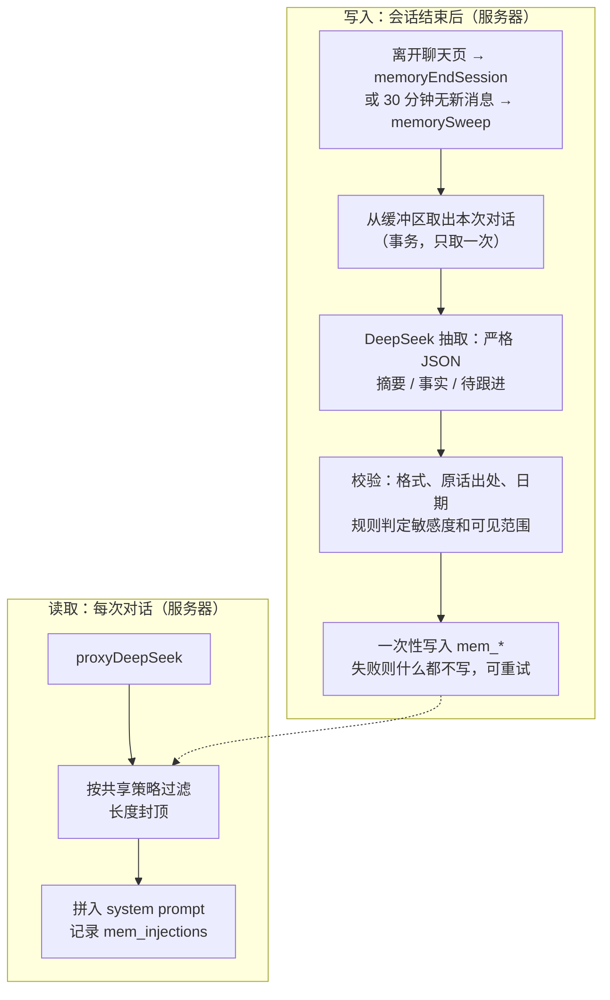

# 记忆模块 v1 实现说明

> 这份写的是**代码里现在是什么样**。要改成什么样，见 `docs/dev/memory-and-entry-spec.md`；研究上为什么这样，见 `docs/research/memory-in-hybrid-arm.md`。

> 2026-10-01 合并进 main（PR #25），未部署。基于《陪住 记忆模块 技术交付文档 v0》。
> 两种开法：Phase B 正式研究里 **A 组全员强制开启**（不能关）；测试时用 `MEMORY_V1` 构建自愿开启。B 组永远没有。

## 一句话

A 组现有的「每个 agent 一段滚动摘要」（记忆 v0）保持不变。v1 是一套新的、在服务器上运行的记忆：会话摘要、结构化画像、待跟进事项，外加老人可以查看和删除的「我記得嘅嘢」页面。## 怎么开启

### Phase B 正式研究：A 组全员强制开

| 开关 | 在哪 |
|---|---|
| 构建开关 | Phase B 构建（`--dart-define=PHASE_B=true`）即可，不需要另加 `MEMORY_V1` |
| 服务器开关 | `meta/memory_config`：`{enabled: true, policy: "C", phaseBArmA: true}`，只能由管理员写 |
| 适用对象 | `arm == "A"` **且** `armAssignmentMode == "randomise"`（由服务器 `assignArm` 在随机分组时写入，客户端改不了） |

- Phase A 的老参与者（`armAssignmentMode` 为空或 `force_a`）继续用 v0，不受影响，虽然他们和 Phase B 在同一个 Firebase 项目里。
- 设置页的「記憶」区只显示说明和「我記得嘅嘢」入口，**没有关闭开关**。
- 停用：把 `enabled` 改成 `false`，立即对所有人生效（kill switch）。

### 测试：三道开关，缺一不可

| 开关 | 在哪 | 默认 |
|---|---|---|
| 构建开关 | `flutter build … --dart-define=MEMORY_V1=true`。不加就看不到任何记忆入口 | 关 |
| 服务器总开关（kill switch） | Firestore 文档 `meta/memory_config`：`{enabled: true, policy: "C"}`，只能由管理员写 | 不存在 = 关 |
| 用户自愿开启 | 设置 → 記憶 →「俾佢哋記得我講過嘅嘢」，写入 `users/{uid}.memory_enabled` | 关 |

Arm B 用户即使三道都开，服务器也不会给他们记忆。

Phase A 的构建不要加 `MEMORY_V1`。

### 部署顺序

1. 先部署 Cloud Functions（`assignArm`、记忆函数）和 Firestore 规则；
2. 再写 `meta/memory_config`；
3. 最后发布 Phase B App。顺序反了，新用户注册时拿不到组别。

## 流程



缓冲区沿用现有的 `agent_contexts/{agentId}.shortTermBuffer`（上一轮已改为：被安全标记的对话不进入）。v1 用户离开聊天页时，不再做客户端的 v0 折叠。

## 数据（`users/{uid}/…`）

| 集合 | 内容 | 客户端权限 |
|---|---|---|
| `mem_facts` | 称呼、家人、居住、兴趣、日常、事件、健康、其他。字段：`visibility`（shared/agent）、`sensitivity`（normal/sensitive）、`status`（active / pending_confirmation / superseded）、`quote`（原话）、`revision_count`、`needs_review` | 读、删；敏感条目可「确认」（只能把 pending_confirmation 改成 active） |
| `mem_summaries` | 每次会话一条，≤150 字，按对话日期记 `day_key` | 读、删 |
| `mem_followups` | 带日期的事，`status` = pending / asked | 读、删 |
| `mem_injections` | 每次注入用了哪些条目、各层数量、策略 | 无（研究用） |
| `mem_extractions` | 抽取记录：状态、重试次数、模型原始输出、被丢弃的条目及原因。成功后清空对话原文 | 无（审计用） |

客户端**不能新增或修改**任何记忆内容，因此不可能给 agent 喂假记忆（MEM-2）。

## 规则（规则为主，模型只负责分类建议）

- **只记老人说过的话**：每条事实和待跟进都要附原话，服务器核对原话确实出现在老人自己的发言里（忽略空格和标点）。对不上的单条丢弃，并记录原因。
- **安全**（T10，决策 0024）：服务器先用 **App 同一份安全词库**（`functions/safety_lexicon.json`，由 `DistressDetector` 生成，测试保证一致）查老人原话。命中 moderate 或 acute 的那一轮和陪伴者的回复不发给模型、不存；这次会话不写摘要。模型另报 `safety_concern`（词库认不出的隐晦说法），为 true 时也不写摘要和敏感条目。模型写出来的东西仍用原来 17 个词再查一次，摘要另外再用 App 词库查一次。
- **「唔好記住」**（T10）：老人说了「唔好記住」「當我冇講過」「唔好話畀人知」等（`functions/memory_forget.js`），这次会话整段不记、不调用模型；以前存下、和这件事字面相近的条目（任何陪伴者）一并删除。陪伴者的确认句有开关 `forgetAckReply`，默认关，文字待定稿。
- **摘要不写敏感内容**（T10）：抽取 prompt v2 要求摘要只写中性内容；服务器判为敏感的摘要不存，以前存的敏感摘要不注入。
- **敏感**：健康类一律算敏感；其余类别由模型标注，再叠加关键词规则。**敏感事实先放在「等你确认」，老人在页面上点「好，记住」之后才会被使用。**
- **可见范围**：称呼、家人、居住算「基本事实」，三个 agent 共享；其余只给来源 agent。敏感内容永远不共享。
- **纠正**：老人纠正时，旧说法标为 superseded（不删除），新说法记 `user_corrected`。同一事实改动 3 次以上会标 `needs_review`，不再注入，等研究者人工查看。
- **共享策略**：`meta/memory_config.policy` 可切换 A（全共享）/ B（全隔离）/ C（分层，默认）。过滤在服务器上执行，不依赖 prompt。
- **记忆分层（T31，决策 0034）**：`layersEnabled` 打开后，上面“可见范围”改为共享层（称呼、家人、居住、作息、兴趣、喜好）和私有层（其余、摘要、待跟进），策略 A、C 都按分层，B 仍不共享。详见 `docs/dev/architecture.md` 第 7 节。

## 注入

- 只注入到聊天类模块：小欣签到、阿珍/阿伯（自由对话、回忆）、通通、首页问候生成。摘要生成、社交建议等不注入。
- 优先级：
  1. 到期的待跟进事项：每次最多 1 条，只在一次对话的第一轮，问过就标记「已问」，过期 7 天不再提；
  2. 基本资料，最多 20 条；
  3. 最近 3 天的摘要，同一天多次对话合并成一行；
  4. 已确认的敏感事实：附带「只可以在对方自己提起时用」。T10 起至少有 5 个名额（`sensitiveFactQuota`），之前是「20 减普通事实条数」，普通事实满了就一条都进不去。
- 整块封顶 2,000 字（约 1,500 tokens）。超长时按顺序裁剪：先裁敏感，再裁摘要，再裁事实。
- 注入块后面附带 v0 文档里的 6 条使用规则（留余地、一次只提一样、敏感不主动提、被纠正不争辩、不编造、不透露其他 agent）。

## 对照 v0 文档的 MEM 条目

| 编号 | 状态 | 说明 |
|---|---|---|
| MEM-1 开关与 kill switch | ✅ | Phase B A 组强制开；测试三道开关；见上 |
| MEM-2 数据模型与安全规则 | ✅ | 规则测试 9 条 |
| MEM-3 会话结束判定 | ✅ | 离开页面 + 30 分钟扫描；事务保证同一会话只抽取一次 |
| MEM-4 抽取 prompt 与 JSON schema | ✅ 实现 / ⏳ 评估 | 原话出处校验保证「不编造」；「精确率 ≥ 90%」需要合成粤语测试集才能评估 |
| MEM-5 敏感与安全过滤 | ✅ | |
| MEM-6 待跟进与日期换算 | ✅ 实现 / ⏳ 评估 | 由模型按「今日日期 + 星期」换算，服务器校验格式和范围；「≥ 20 种表达」需要测试集 |
| MEM-7 切块、向量化与检索（RAG） | ❌ 未做 | 按计划最后评估：需要另选 embedding 服务（DeepSeek 不提供），会多一个第三方拿到数据 |
| MEM-8 注入组装与共享策略 | ✅ | 测试覆盖：策略 C 下其他 agent 的私有记忆出现次数 = 0，长度不超限 |
| MEM-9 主动跟进开场 | ✅ | 与 FCM 推送联动未做（待讨论） |
| MEM-10 「我記得嘅嘢」页面与注入日志 | ✅ 页面、删除、确认、日志、口头删除（T10） | 「唔好記住」用规则 + 关键词识别，见决策 0024 |

## 测试

```bash
cd functions && node test/memory_test.js                       # 28 条纯逻辑
firebase emulators:exec --only firestore --project loneliness-pilot-dev \
  "cd functions && node test/memory_emulator_test.js"           # 9 条读写集成
firebase emulators:exec --only firestore --project loneliness-pilot-dev \
  "cd test/rules && npm install && npm test"                    # 规则 31 条（含记忆 9 条）
flutter test --dart-define=MEMORY_V1=true test/memory_v1_client_test.dart
```

另外在模拟器上做过端到端冒烟测试（DeepSeek 用桩替代）：会话结束后记忆写入成功；小欣的 prompt 里有通通记下的「稱呼」，没有通通私有的「兴趣」；用户关闭记忆后 prompt 里不再有记忆块；注入日志正确。

## 待你 / PI 决定

- **敏感确认的方式。** 现在是在「我記得嘅嘢」页面确认。v0 文档写的是「下次对话开头问一句」，那种做法更自然，但更难做对，可以作为下一步。
- **ICF 修订**：覆盖「A 组强制记忆」以及记忆内容发送给 DeepSeek（负责人修改中）。

## 已定

- **onboarding 说明**：Phase B A 组在 onboarding 第一页看到「佢哋會記得你講過嘅嘢，下次傾偈就可以接得上。你隨時可以喺『設定 → 我記得嘅嘢』睇返同刪走。」B 组和 Phase A 老用户看不到。
- **「睇医生」类待跟进**：只有「医生、覆诊」这类约诊字眼的不算敏感，可以主动问「上次睇醫生點呀？」；癌、手术、病等仍算敏感。维持现状。
- **保留期限：研究结束后 3 年**，到期用下面的脚本 `--all --confirm` 全部删除。参与者退出研究时，按其要求单独删除。

## 删除记忆（退出研究 / 研究结束后 3 年）

`tool/delete_memory.js` 删除 `mem_*` 五个集合，以及 v0 的 `agent_contexts`、`memory/*`、`shared_context`、`agent_greetings`、`cross_module_callbacks`。**不碰**研究数据（turns、sessions、问卷、情绪、安全事件）。默认只演示（dry run），加 `--confirm` 才真删；真删后把该用户 `memory_enabled` 设为 false，并记 `memoryDeletedAt` 和 `memoryWithdrawnAt`（T10）。只清不停（测试账号）加 `--keep-memory-on`。

**单条删除也连带**（T10）：页面上删一条事实或跟进，服务器触发器 `memoryFactDeleted` / `memoryFollowupDeleted` 同时删掉它来源那次会话的摘要，以及措辞完全相同的其他事实或跟进（开关 `deleteSummaryWithItem`）。

```bash
cd functions && npm ci && cd ..
export GOOGLE_APPLICATION_CREDENTIALS=/path/to/service-account.json
NODE_PATH=functions/node_modules node tool/delete_memory.js --email=x@hku.hk            # 先看会删多少
NODE_PATH=functions/node_modules node tool/delete_memory.js --email=x@hku.hk --confirm  # 退出研究
NODE_PATH=functions/node_modules node tool/delete_memory.js --all --confirm             # 研究结束后 3 年
```

T10 起，服务器见到 `memoryWithdrawnAt` 就不再记录和注入，Phase B A 组的「强制开」也让位（开关 `honourMemoryWithdrawal`，默认开）。这个字段只有服务器能写。`tool/delete_participant.js` 删掉整个人后用户文档不存在，本来就不会再记录。
- **合成粤语测试对话集（建议 30 段）**：MEM-4、MEM-6 的准确率评估依赖它。
- **成本**：每次会话结束多 1 次 DeepSeek 调用（约 1–2k tokens）；每轮对话的 prompt 最多多约 1,500 tokens。
