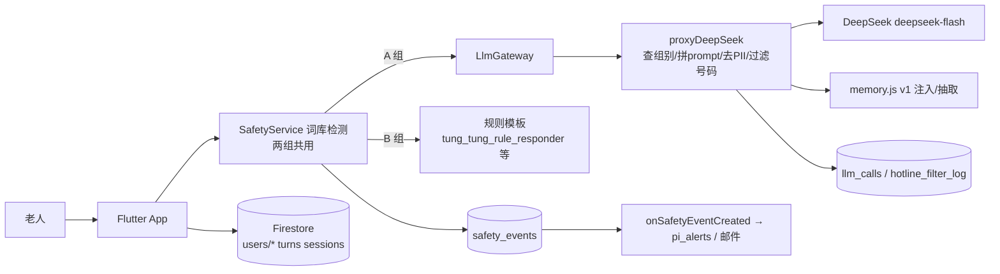

# 陪住系统说明书（代码核对版）

> 核对日期：2026-10-10，`main` @ b4b6af5。只读代码写成，没有改代码。每条事实后括号里是来源文件（行号以当日代码为准）。"（推断）"表示代码没有直说。

## 摘要

1. 系统 = 一个 Flutter App（两组同一安装包）+ Firebase Cloud Functions（asia-east2）+ Firestore + DeepSeek（`deepseek-flash`，思考关闭）。
2. 分组只看 `users/{uid}.arm`；Phase B 包里 arm 为空就按规则组显示（`lib/core/arm/arm_scope.dart:26-43`）。
3. Hybrid 组每条消息：App 词库检测 → 云函数查组别 → 拼 prompt + 记忆 → 去个人信息 → DeepSeek → 服务器和 App 各过一次电话号码 → 回复再查一次词库。
4. 规则组：同一页面壳，通通按关键词选模板，签到、回忆是表单；不调 LLM，服务器另有一道拒绝。
5. 三个 agent 用同一个模型，只有 prompt 文件和温度（0.7 / 0.5 / 0.85）不同。
6. 发给模型的历史是本页面本次会话的全部气泡，没有条数或字数上限；离开页面即丢。
7. 跨会话记忆有两套：v0（App 端 ≤500 字滚动摘要）和 v1（服务器抽取的事实/摘要/跟进）；Phase B Hybrid 组走 v1，且必须有 `meta/memory_config` 才生效。
8. 安全词库 v5-2026-09，269 个词，四级；两组同一份代码，无组别分支。
9. 测试：Flutter 6 套 496 通过、37 跳过；后端单元 + 模拟器 + 规则全部通过，0 失败。
10. 最大未解：规则组防线全靠调用方（`LlmGateway` 不查组别）、41 条模板全是占位、生产配置是否已写入无法从代码确认。

## 1. 总览

| 块 | 位置 | 要点 |
|---|---|---|
| App | `lib/` | 4 个底部 tab（`lib/app/main_shell.dart:142-166`，无组别分支）；按组别切页面用 `ArmGate` / `Arm.isA` |
| Cloud Functions | `functions/index.js` 等 | `proxyDeepSeek`（唯一聊天入口）、分组登记、记忆整理、转介判断、搜索、安全分类器中转、安全事件触发器、定时推送 |
| Firestore | `firestore.rules` | 每人 `users/{uid}` 下：`sessions`、`turns`、`agent_contexts`、`shared_context`、`mem_*`、`rule_reply_history`、问卷集合；全局：`safety_events`、`pi_alerts`、`llm_calls`、`llm_denied_log`、`hotline_filter_log`、`enrollments`、`randomization_*`、`meta/*`、`app_config/*`（`firestore.rules:103-378`） |
| 外部 API | `functions/llm_log.js:21`、`index.js:746-812` | DeepSeek `https://api.deepseek.com/chat/completions`（密钥是 Firebase secret，`index.js:28`）；Brave Search（开关默认关）；Google Speech（App 未调用） |

## 2. 一条消息的旅程：「我今日有啲悶」

### Hybrid 组（以小欣签到页为例）

1. 用户发送，页面把本次会话全部气泡（含开场白、安全模板气泡）作为 `history` 交给 `LlmGateway.send`（`lib/features/context/presentation/pages/check_in_arm_a.dart:519-523`）。
2. **安全检测第 1 次**：`SafetyService.checkUserText` 用词库查输入（`lib/core/llm/llm_gateway.dart:109-134`）。「悶」不在词库，判 none（`lib/core/safety/distress_detector.dart:406-417`，纯子串匹配、先命中先算）。若 acute：不调模型，返回 `shortCircuited`（`llm_gateway.dart:139-152`）；若 moderate：照常调模型，之后弹支援面板。
3. 拼 `contextSuffix`：persona 摘要块、`[今週主題]`、`[模組]`（`llm_gateway.dart:157-161`；`lib/core/agents/persona_resolver.dart:109-152`）。
4. 调用云函数 `proxyDeepSeek`，payload 为 `messages`（历史 + 本句）、`moduleId`、`promptKey`、`agentId`、`variantName`、`contextSuffix`、`agentContext`（`llm_gateway.dart:450-472`）。
5. 服务器：登录校验 → `assertLlmAllowed` 读 `users/{uid}.arm`，B 组写 `llm_denied_log` 并拒绝，缓存 10 分钟（`functions/index.js:273-310, 367`）→ `resolvePrompt` 读 prompt 文件并接上 `contextSuffix`（`index.js:135-157`）→ 记忆 v1 用户追加 `<memory>` 块（`index.js:393-401`；`functions/memory.js:795-841`）→ 追加 `hotline_rule.v1`（`index.js:403-413`）→ 所有消息过 `stripPII`（`index.js:182-200, 419-422`）→ `deepSeekChat`，`max_tokens 800`、`top_p 0.95`、按 agent 定温度、超时 50 秒（`index.js:426-453`）→ 写一条 `llm_calls`（`functions/llm_log.js:88-129`）→ 回复里电话号码换成「【緊急熱線】」并记 `hotline_filter_log`（`index.js:472-490`）→ 算 5 个 LLM 标记返回（`index.js:492-508`）。
6. **安全检测第 2 次**：App 对回复再查词库，级别高于输入才写 `ai_output_scan` 事件，回复不拦截（`llm_gateway.dart:181-193`；`safety_check.dart:353-365`）。
7. App 再过一次号码过滤（`llm_gateway.dart:251-256`），显示；「【緊急熱線】」渲染成危机页链接（`lib/shared/widgets/rich_chat_text.dart:27-33`）。
8. 记录：`turns` 一条（无原文，有 `detector.tier`、`llm.status/model/promptVersion`），首条消息时建 `sessions`（`lib/core/session/chat_session_recorder.dart:135-194, 349-394`）；未标记轮次进 `agent_contexts.shortTermBuffer`（`check_in_arm_a.dart:543-555`）。
9. 离开页面：会话结束；v0 用户折叠摘要，v1 用户调 `memoryEndSession`（`lib/core/agent_context/rolling_summary_compiler.dart:54-72`）；用户发言 ≥2 轮弹 Brief PR（`lib/core/config/phase_a_config.dart:24`）。

### 规则组（以通通页为例；签到、回忆是表单，见第 5 节）

1. 页面在 build 时记 `_ruleBased = !Arm.isA`（`lib/features/curious_companion/presentation/pages/tung_tung_page.dart:180`），发送走 `_sendRuleBased`（`:288-291`）。
2. **安全检测**：同一个 `SafetyService`、同一词库（`tung_tung_page.dart:628-647`）。acute → 危机模板、结束会话、危机页（`:675-686`）；moderate → 写事件、弹面板。
3. 没命中：若远端开关 `searchOffReplyEnabled` 开且像要上网查，回固定一句（`:693-701`）；否则 `TungTungRuleResponder.reply`（`:702-706`）。
4. 写 `turns`，`llm.status = rule_based`（`:670`）；分析事件 `tung_tung_rule_reply` 带模板编号（`:724-730`）。不写记忆缓冲、不折叠摘要（`:606-608, 883`）。
5. **服务器从未被调用**。即使调用，`assertLlmAllowed` 也会拒绝（`functions/index.js:296-310`）。

## 3. 三个 agent

| | 小欣 `siu_yan` | 阿珍/阿伯 `ah_jan_ah_bak` | 通通 `tung_tung` |
|---|---|---|---|
| prompt 文件 | `functions/prompts/siu_yan_v1.txt`（82 行，`siu_yan_v1@2026-06`） | `ah_jan_ah_bak_v1.txt`（117 行，`@2026-09`，`{{VARIANT_NAME}}` 按老人选的性别替换，`index.js:147-148`） | App 仍发 `tung_tung_v1`，服务器映射到 `tung_tung.v2.txt`（100 行，`@2026-10`，`index.js:59-61`） |
| 模型 | 三者同为 `deepseek-flash`，思考关闭（`index.js:40-41`） | 同 | 同 |
| 温度 | 0.7 | 0.5 | 0.85（`index.js:248-261`） |
| 角色（prompt 要点） | 日常陪伴、PPR-Caring；唯一可提议「望一望心入面」；每句扣住具体细节；沉重话题 1–2 句；禁依附语 | 同辈听者、PPR-Understanding；每周主题回忆；先听后问、一次一问；不解读；绝不提想法练习；总结 ≤80 字 | 好奇闲聊、PPR-Social-Integration；文章问答只按文章答，闲聊 3–4 句；情绪转小欣、回忆转阿珍/阿伯；v2 删掉「幫你查」邀请 |
| 共同规则 | 粤语口语繁体；自认 AI；不诊断、不理财；不复述电话/地址；每次对话最多一次转介 | | |
| 代码层差异 | 签到、周小结、社交建议、行动计划 | 回忆页、反思对话页 | 通通页、文章问答；B 组唯一有对话的 agent |

三者共享的服务器尾巴：`hotline_rule.v1.txt`（不写任何号码，`functions/prompts/hotline_rule.v1.txt`）。安全模板按 agent 各一套 moderate/acute × 中英（`functions/prompts/safety_acknowledgements.json`，v2-2026-09）。

## 4. 记忆现状

**本次会话内**：发给模型的 `messages` 是页面内存里的全部气泡，无条数、字数截断（`check_in_arm_a.dart:519-522`、`tung_tung_page.dart:422-425`、`reflective_dialogue_page.dart:234-237`、`reminiscence_arm_a_page.dart:402-405`；服务器也不截，`index.js:419-422`）。唯一例外是转介判断只送最后 10 轮（`index.js:673-677`）。气泡列表是页面 State 的局部变量，关页即丢，重开不恢复（`check_in_arm_a.dart:77`）。

**跨会话 / 跨天**：有，两套按用户选一（`lib/core/memory/memory_mode.dart:27-40`）：

| | v0 | v1 |
|---|---|---|
| 谁 | pilot / Phase A（`armAssignmentMode == force_a`） | Phase B Hybrid 组（`arm A` + `randomise`）或 `MEMORY_V1` 包自愿开启；B 组永远 off |
| 存哪 | `users/{uid}/agent_contexts/{agentId}`：`shortTermBuffer`（最多 20 条）+ `rollingSummary`（≤500 字）（`lib/core/agent_context/agent_context_service.dart:149-153`） | `users/{uid}/mem_facts` / `mem_summaries` / `mem_followups`，服务器写（`functions/memory.js:1024-1089`） |
| 何时更新 | 离开页面时调一次模型折叠（`rolling_summary_compiler.dart:74-151`） | 离开页面调 `memoryEndSession`；每 15 分钟 `memorySweep` 补（`index.js:1617-1711`） |
| 注入内容 | `[過往摘要]` 块放进 `contextSuffix`（`persona_resolver.dart:113-121`） | 最多 1 条跟进、20 条事实（敏感另给 5 个名额）、近 3 天摘要，总块 ≤2000 字（`memory.js:107-119, 494-540`） |
| 前提 | 「保留對話紀錄」开 | **Firestore 必须有 `meta/memory_config.enabled = true`**（`memory.js:652-669, 702-713`）；没有则 v1 不工作，而 App 已不再写 v0 摘要（`persona_resolver.dart:86-87`）→ 两套都没有 |

**三个 agent 之间**：
- v0：各自独立，只有 `shared_context.recentMoodSummary`（最近心情一句）给小欣用（`lib/core/agent_context/shared_context_service.dart`；`persona_resolver.dart:142-150`）。`pendingReferrals` 写了但没人读（`drainOnArrival` 无调用方）。
- v1：按策略 A/B/C，默认 C：只有 `name`/`family`/`living` 三类且非敏感的事实跨 agent 可见，摘要和跟进各 agent 私有；未勾选 `consent.sharedContextUse` 的人强制 B（完全隔离）（`memory.js:67, 473-479, 680-684`）。
- 规则组：没有任何记忆（`memory_mode.dart:28`；`memory.js:704`）。

## 5. 规则组（重点）

### 5.1 回复怎么产生

| 模块 | 机制 | 文件 | 条数 |
|---|---|---|---|
| 通通对话 | 关键词子串匹配，10 个话题按顺序先命中先算（health 排第一）；模板按本次会话用户轮数取模轮换，不随机、不记历史；无命中用通用模板；每第 3 轮追加一条开场题 | `lib/features/curious_companion/data/tung_tung_rule_responder.dart:184-223` | 10 话题、134 个关键词、27 条模板 + 6 条通用 |
| 通通开场题 | 按「距 2026-01-01 的天数」取模，每天换一条 | `tung_tung_rule_pool.dart:34-85`；`tung_tung_page.dart:189-199` | 20 条（注释说要砍到 16，代码仍 20） |
| 签到 B | 心情脸 + 选择题 + 一段文字，固定回一句「收到喇。聽日再見。」；开关开时按心情档选模板 | `lib/features/context/presentation/pages/check_in_arm_b.dart:177-293` | 模板 9 条 |
| 回忆 B | 固定主题开场 + 输入框；开关开时多一个心情脸和一条模板 | `lib/features/reminiscence/presentation/pages/reminiscence_arm_b_page.dart:66, 115-180` | 模板 32 条（4 周 × 4 档 × 2） |
| 模板池 | `siu_yan × check_in × {low,mid,high}`，`ah_jan_ah_bak × w1–w4 × {low,mid,high,none}`；近 3 次不重复，记在 `users/{uid}/rule_reply_history/{agentId}` | `lib/features/rule_replies/data/rule_reply_pool.dart:45-68, 405-427`；`rule_reply_history_store.dart` | **41 条，全部以【占位】开头**，因此默认关闭（`:410-412`） |
| M6 社交建议 | 固定池按日序号轮换，每天 2 条 | `lib/features/social_suggestions/data/suggestion_pool.dart` | 16 条 |
| M7 行动计划 | 固定表单：4 个下拉 × 3 选项，无文字模板 | `action_loop_arm_b_page.dart:126-144` | — |
| M5 反思题库 | **未在代码中找到**固定题库；B 组根本没有入口 | `my_story_page.dart:65` | — |

### 5.2 两组功能对照

| 功能 | 相同？ | 依据 |
|---|---|---|
| 4 个 tab、导航、设置页（除记忆段）、同意页 | 相同 | `main_shell.dart`、`lib/features/consent/` 无组别判断 |
| 推送（每日心情、周问卷、W2 DJG、行动计划提醒） | 相同 | `fcm_service.dart` 无组别判断；`djg_w2.js`、`reminders.js` 两组同发 |
| Brief PR、周 PR、每日心情、DJG、PGIC、PPR | 相同（只在记录里带 `arm` 字段） | `djg_w2_page.dart:6-7`；`brief_pr_page.dart:106` |
| 安全检测、危机页、PI 告警 | 相同 | `lib/core/safety/` 无 `Arm` 代码分支；`functions/pi_alert.js:1-13` |
| 小欣签到 | 不同：LLM 对话 vs 表单 | `check_in_page.dart:16-19`（全库唯一 `ArmGate`） |
| 阿珍/阿伯回忆 | 不同：LLM 对话 vs 表单 | `reminiscence_landing.dart:84-90` |
| 阿珍/阿伯自由对话 | B 无入口 | `my_story_page.dart:65` |
| 通通 | 同页面，引擎不同；B 无搜索、无麦克风 | `tung_tung_page.dart:108-109, 180` |
| M6 / M7 / M8「問通通呢篇」/ M9 周小结卡 / 首页个性化问候 / 跨 agent 转介 | B 用固定池 / 固定表单 / 无按钮 / 无卡 / 无问候 / 无转介 | `social_suggestions_page.dart:69,125,169`；`action_loop_landing.dart:107`；`education_article_page.dart:164`；`progress_page.dart:92,170`；`today_page.dart:82` |
| 记忆（设置段、onboarding 说明、「我記得嘅嘢」）、回忆总结再编辑 | B 无 | `settings_page.dart:165-166`；`m3_session_detail_page.dart:136` |

### 5.3 分组怎么切换

- 字段：`users/{uid}.arm`（"A"/"B"），由服务器写；客户端建档不能带、之后不能改（`firestore.rules:69, 103-114`）。登记时 `enrollParticipant` 按情感分分层、取置换区组序列写入（`functions/randomization.js`）。
- 读取：登录后 `UserProfile.fromMap` 解析（`user_profile.dart:475`），放进 `AppSettingsScope`（`auth_gate.dart:57-63`）。
- 判断：`Arm.of`：非 `PHASE_B` 包一律 A；`FORCE_ARM` 可覆盖（仅调试）；否则读 profile，空 → B（`arm_scope.dart:26-35`）。
- 服务器第二道：`assertLlmAllowed` 在 `proxyDeepSeek`、`referralJudgement`、`webSearch` 入口（`index.js:367, 611, 762`）；`memoryEndSession` 用 `inScope` 排除 B（`memory.js:704`）。`classifySafety` 两组都可调，不经这道（`index.js:541-573`）。
- 注意：`LlmGateway.send` 本身不查组别，`armCode` 只决定是否写 `llm_turn_features`（`llm_gateway.dart:83, 214`）。B 组不调 LLM 全靠各页面的 `Arm.isA` 判断。`HybridOnlyMount` 写了但从未使用（`lib/core/feature_flags/hybrid_only_mount.dart`）。

## 6. 测试现状

**怎么跑**：`tool/ci_flutter_tests.sh`（6 套，不同 `--dart-define`）、`tool/ci_backend_tests.sh`（Node 单元 → Firestore 模拟器跑规则 mocha 和 `*_emulator_test.js` → 三模拟器跑删除和同意脚本）。CI 每次 push/PR 跑这两个脚本（`.github/workflows/ci.yml`）。`functions/test/llm_live_smoke.js` 只手动跑。

**覆盖规则组和安全流程的测试**（全部清单 79 个文件，见各目录；这里只列相关的）：

| 文件 | 测什么 | 跑法 |
|---|---|---|
| `test/arm_gate_test.dart` | ArmGate 按 arm 切换、空 arm → B、Phase A 包全 A | 默认 + `PHASE_B` |
| `test/tung_tung_arm_b_test.dart` | B 组通通：开场题、模板回复、acute 显示热线不回模板、无麦克风/搜索 | **只在 `PHASE_B+FORCE_ARM=B` 套执行**，默认套全部跳过 |
| `test/tung_tung_rule_responder_test.dart` | 关键词命中、health 优先、通用回退、确定性、每 3 轮开场题、不复述用户原话 | 默认 |
| `test/rule_reply_pool_test.dart` / `rule_reply_pages_test.dart` | 模板池格式、占位守卫、近 3 次不重复、安全门（moderate/acute 不给模板）、签到 B / 回忆 B 页面开关前后 | `RULE_TEMPLATE_REPLIES` 两套 |
| `test/rule_submission_flow_test.dart` | 一次提交 = 一次 `rule_based` 会话；acute 不弹 Brief PR | 默认 |
| `test/safety_check_test.dart` | T6 20 句两组同结果；22 个输入点都检测；一轮一事件；热线过滤；表单页 `checkAndRoute` 路由 | 默认 |
| `test/distress_*_test.dart`（3 个） | 分级、19/48 拆分、acute 召回 ≥0.95、none 精确率 ≥0.90 | 默认 |
| `test/safety_classifier_test.dart` | 分类器槽位：默认关、只升不降、超时回退、两组同结果 | 默认 |
| `test/llm_gateway_test.dart` / `phase_a_gateway_test.dart` | acute 短路不调模型；moderate 照调；回复被标记 | 默认 |
| `test/safety_lexicon_export_test.dart` | `functions/safety_lexicon.json` 与 Dart 词库逐字一致 | 默认 |
| `functions/test/safety_t7_emulator_test.js` | 服务器热线过滤、事件去重、B 组先被拒、PI 告警不带组别字段 | 模拟器 |
| `functions/test/llm_calls_emulator_test.js` | 每次调用一条 `llm_calls`；B 组任何入口都不产生 | 模拟器 |
| `functions/test/memory_acceptance_emulator_test.js` / `memory_test.js` | B 组无抽取、无注入；安全轮次不进记忆 | 模拟器 / 单元 |
| `functions/test/hotline_filter_test.js`、`safety_lexicon_test.js` | 43 条号码用例；17 条词库共享用例 | 单元 |
| `test/rules/safety_events_rules.test.js`、`profile_arm.test.js` | `safety_events` 写入规则；客户端不能写 `arm` | 模拟器 mocha |

**实际运行结果**（本机装 Flutter 3.35.3、Node 22、firebase-tools）：

| 套 | 结果 |
|---|---|
| Flutter 默认（Phase A） | 387 通过，21 跳过，0 失败 |
| Flutter `PHASE_B` 分组 | 60 通过，7 跳过 |
| Flutter `PHASE_B+FORCE_ARM=B` | 5 通过，1 跳过 |
| Flutter `MEMORY_V1` | 16 通过 |
| Flutter 模板回应（占位守卫 / 开） | 12 通过 6 跳过 / 16 通过 2 跳过 |
| Functions 单元 | 7 个有计数脚本共 102 条通过 + 3 个断言脚本通过 |
| Firestore 规则 mocha | 85 通过 |
| Functions 模拟器测试 | 14 个脚本 123 条通过（另 2 个只报「all passed」） |
| 删除 / 同意脚本 | 9 通过 |
| **合计** | **0 失败**；两个脚本退出码都是 0 |

**尚未覆盖的关键行为**：
- `LlmGateway` 无组别守卫；没有测试证明 B 组不能经其他导航路径到达 A 组页面（`ReflectiveDialoguePage` 等页面内部不查组别）。
- 两组界面一致性的 golden 对比永久跳过，`test/parity/goldens/` 不存在（`test/parity/arm_gate_parity_test.dart`）。
- B 组行动计划表单页、M6 B 组页面、进度页 B 分支：未找到页面级测试。
- 10 分钟空闲结束会话、`app_killed` 补记：未找到测试。
- 「`meta/memory_config` 缺失时 Hybrid 组两套记忆都没有」没有测试断言。
- 真实 DeepSeek 调用只有手动脚本。

## 7. 安全架构

- **词库**：`DistressDetector.wordlistVersion = 'v5-2026-09'`（`distress_detector.dart:164`），269 个词：acute 160、moderate_interrupt 48（含 4 个「冇晒希望」类，层级标「PI 待定」，`:170`）、moderate_review 19、low 42。纯小写子串匹配，按 acute → interrupt → review → low 顺序先命中先算（`:378-389, 406-417`）；无否定句处理、无繁简转换（繁简分别列词）。服务器用同一份导出 JSON（`functions/safety_lexicon.json`），测试保证逐字一致。
- **分级后果**（`distress_router.dart:47-80`；`llm_gateway.dart:139-152`）：acute → 不调模型、全屏危机页；moderate_interrupt → 支援面板，模型照调；moderate_review → 只写事件；low/none → 不写事件。
- **输入点**：22 个（`safety_check.dart:53-86`）。聊天类永远检测；表单类受 `safetyScanAllInputs` 控制，默认开（`phase_a_config.dart:31`）。
- **`safety_events` 写入**（`lib/core/safety/safety_event_writer.dart:60-110`）：只在 moderate 及以上写；字段 `uid`、`source`（user_input / ai_output_scan / form）、`inputPoint`、`turnId`、`textHash`（SHA-256）、`level`（旧四档）、`tier`、`category`、`lexiconVersion`、`matchedTerm`、`agentId`、`sessionId`、`createdAt`；**不存原文、不存组别**。规则要求 `uid/source/textHash/level` 且禁止客户端写去重字段（`firestore.rules:254-268`）。
- **服务器处理**（`index.js:1008-1176`）：`dedup_key = sha256(uid|turn|turnId)`，同一轮输入和回复只算一条，高级别的补升级主事件；只有 acute 写 `pi_alerts`（`uid`、研究编号、级别、去重键、是否测试号，不带来源/输入点/agent）并发邮件（测试账号不发；无 SMTP 密钥则只写库）。
- **热线**：模型被要求写「【緊急熱線】」代替号码；服务器和 App 各替换一次，每次记 `hotline_filter_log`（不存原文）。危机资源 4 条（生命熱線、撒瑪利亞會、HA 精神健康專線、999），`verifiedDate` 为空（`functions/prompts/crisis_resources.json`）。
- **分类器槽位**：两组共用，默认关（App 和服务器两个开关都要开），只升不降、超时 1.5 秒回退词库（`lib/core/safety/safety_classifier.dart:221-227`；`functions/safety_classifier.js:109-158`）。
- **记忆侧**：服务器用同一词库剔除命中轮次，该会话不写摘要（`memory.js:853-878, 432-438`）。

## 8. 未解决问题

**代码里的 TODO**：只有一处，回忆 A 页语音输入未做（`reminiscence_arm_a_page.dart:36`）。

**相互矛盾或过时**：
1. `test/sprint4_spec_alignment_test.dart` 文件头写「16 条通通题库」，断言却是 20 条；`tung_tung_rule_pool.dart:3-4` 注释说要砍到 16，代码仍 20。
2. `functions/test/hotline_filter_test.js` 头注释指向不存在的 `test/hotline_filter_test.dart`；实际在 `safety_check_test.dart:328`。
3. `docs/dev/backlog.md` #27、#35、#54 后半所列事项在代码里已完成（「唔好記住」、禁止客户端补写 arm、`rule_reply_safety.dart` 走 SafetyService）。
4. 三个 prompt 都说会注入 `named_entities` / `theme_threads`，但写入函数无调用方，永远为空（`agent_context_service.dart:221-297`）。
5. `pending_prompts_banner.dart:115` 空 arm 默认记 'A'，其他记录处默认 'B'。
6. `education_article_page.dart` 的 `_askMode` 永远为 false，页内问答分支不可达。
7. 服务器不会对 v1 用户丢弃 `contextSuffix`，靠 App 把 v0 摘要置空才不重复注入（`persona_resolver.dart:86-87`）。
8. 安全模板气泡、fallback 提示也当作 assistant 历史送给模型。

**我不确定的地方**：
- 线上 Functions 是否已是本仓库版本（backlog #24 说线上仍请求 `deepseek-chat`，代码无法证实）。
- 生产 Firestore 是否已有 `meta/memory_config`、`meta/randomization_config` 和分配序列；缺一个，Hybrid 组记忆或登记就不工作。
- 是否还有我没找到的导航路径让 B 组进入 A 组页面（推断：没有，但无防护层保证）。
